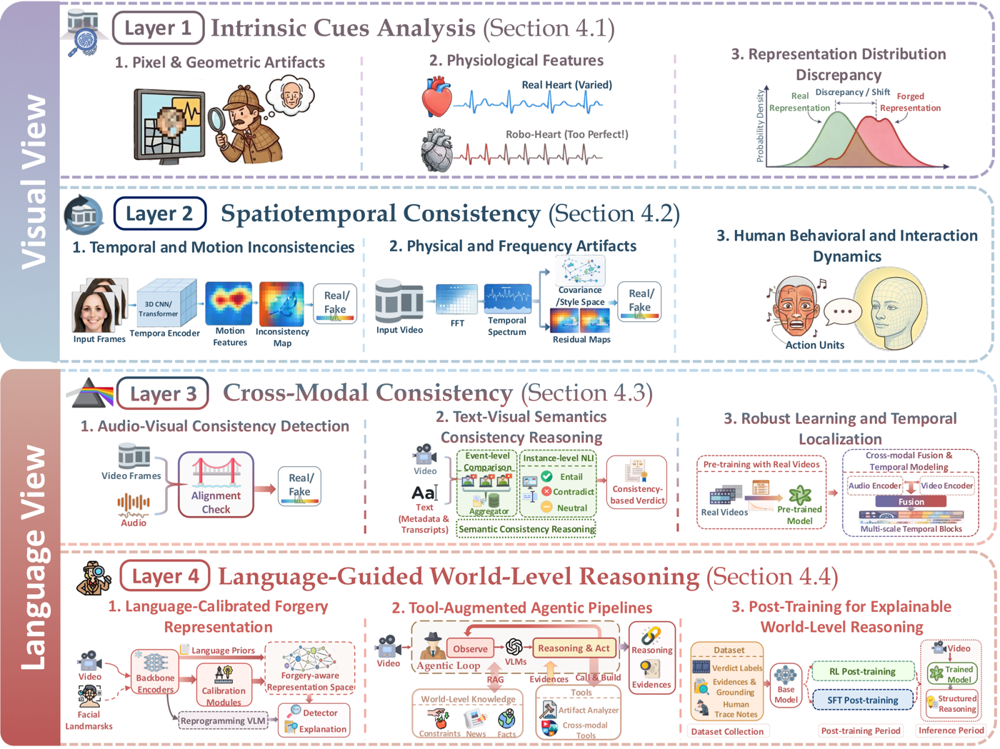
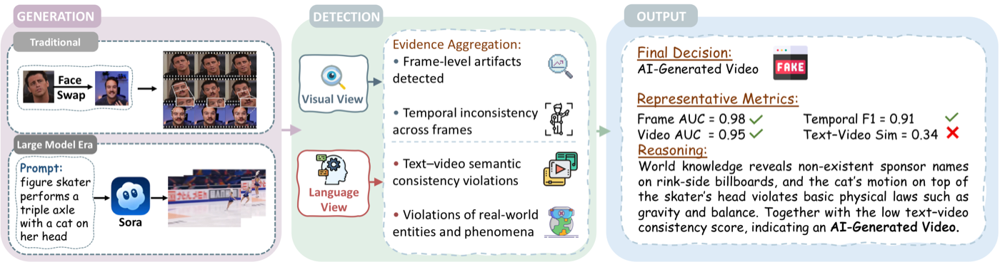
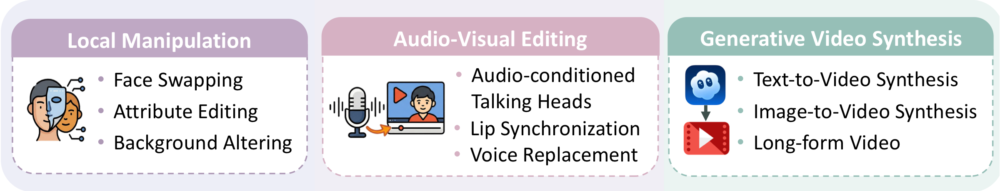
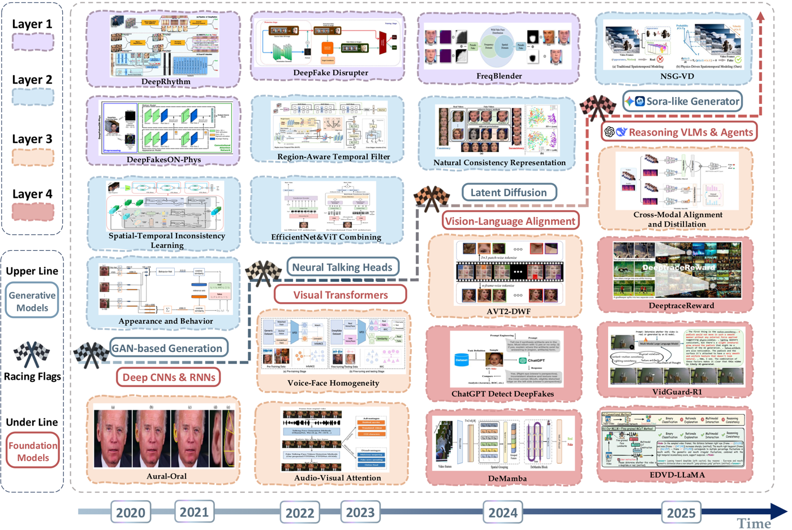

<h1 align="center">
  <strong>Detecting AI-Generated Video: A Vision-Language Dual-View Survey</strong>
</h1>

  

## 📢 Timeline

- [2026/03/26] We release this repository for **Detecting AI-Generated Video: A Vision-Language Dual-View Survey**. More updates on papers, benchmarks, and resources will follow.

  
  
<em><strong>Figure:</strong> Overview of the proposed <strong>Vision-Language Dual-View</strong> taxonomy, organizing AIGC-V detection from intrinsic visual cues to world-level reasoning.</em>

## 👋 Introduction

This repository reorganizes **"Detecting AI-Generated Video: A Vision-Language Dual-View Survey"** into a visual reading path, connecting the central taxonomy to the generation paradigms, detection methods, benchmarks, and paper list behind the survey.

The evolving realism of **AI-Generated Content-Videos (AIGC-V)** is rapidly rendering traditional artifact-centric detection insufficient, driving a shift from low-level inspection to high-level semantic verification. In this survey, we reframe AIGC-V detection as **factual fidelity verification**: whether the events, entities, and physical processes depicted in a video remain consistent with real-world facts.

To systematize this fast-evolving area, we propose a **Vision-Language Dual-View** taxonomy that organizes methods into four layers: **(1) Intrinsic Cue Analysis**, **(2) Spatiotemporal Consistency**, **(3) Cross-Modal Consistency**, and **(4) Language-Guided World-Level Reasoning**. This framing highlights the transition from artifact matching in traditional deepfake detection to evidence-based semantic verification enabled by vision-language models and agentic reasoning pipelines. Based on a review of **221 works as of March 2026**, we synthesize AIGC-V generation paradigms, detection methods, evaluation metrics, benchmarks, and open challenges toward robust, explainable, and trustworthy detection.

## 🧭 Reading Guide

| Section | What it covers | Jump to |
| --- | --- | --- |
| Paradigms | How AI-generated videos are produced: local manipulation, audio-visual editing, and full video synthesis | [Overview](paradigms/README.md), [Local Manipulation](paradigms/README.md#local-manipulation), [Audio-Visual Editing](paradigms/README.md#audio-visual-editing), [Generative Video Synthesis](paradigms/README.md#generative-video-synthesis) |
| Methods | How they are detected: visual evidence, cross-modal consistency, and world-grounded reasoning across four layers | [Overview](methods/README.md), [L1](methods/layer-1-intrinsic-cues.md), [L2](methods/layer-2-spatiotemporal.md), [L3](methods/layer-3-cross-modal.md), [L4](methods/layer-4-world-level-reasoning.md) |
| Benchmarks | Datasets, evaluation families, and diagnostic resources for both detection and explanation | [Overview](benchmarks/README.md), [LMV](benchmarks/local-manipulation-video.md), [AVE](benchmarks/audio-visual-editing.md), [GVS](benchmarks/generative-video-synthesis.md), [Adjacent Diagnostics](benchmarks/adjacent-diagnostics.md) |
| Papers | Full paper-first index across paradigms, methods, and benchmarks | [Paper List](#-paper-list) |

## 💡 Core Concepts

### 1. Problem Framing

  
  
<em><strong>Figure:</strong> An AIGC-V detection pipeline under the dual-view perspective, linking generated inputs, visual and language analysis, and outputs at different verification levels.</em>

AI-generated video detection is framed as **factual fidelity verification**: not only whether a clip is synthetic, but which claim, identity, event, or segment fails consistency. The operational view is expanded in [Detection methods](methods/README.md) and [Benchmarks and diagnostics](benchmarks/README.md).

### 2. AIGC-V Paradigms

  
  
<em><strong>Figure:</strong> Taxonomy of AIGC-V generation paradigms, spanning local manipulation, audio-visual editing, and full generative video synthesis.</em>

The generation side is split into three settings: **[Local Manipulation](paradigms/README.md#local-manipulation)** edits parts of a real recorded video, **[Audio-Visual Editing](paradigms/README.md#audio-visual-editing)** changes speech-driven facial performance, and **[Generative Video Synthesis](paradigms/README.md#generative-video-synthesis)** creates the clip itself. The full taxonomy and representative systems are collected in the [Paradigms overview](paradigms/README.md).

### 3. Vision-Language Dual-View Taxonomy
The overview figure at the top of this page summarizes the taxonomy. It moves from what can be seen directly in frames and motion to what must be verified across modalities and against external knowledge. **Layers 1-2** focus on visual evidence inside the video, while **Layers 3-4** test whether speech, text, events, and implied claims remain mutually and externally consistent. The complete structure is summarized in the [Methods overview](methods/README.md) and expanded in [Layer 1](methods/layer-1-intrinsic-cues.md), [Layer 2](methods/layer-2-spatiotemporal.md), [Layer 3](methods/layer-3-cross-modal.md), and [Layer 4](methods/layer-4-world-level-reasoning.md).

### 4. Method Landscape

  
  
<em><strong>Figure:</strong> Method landscape showing the field's shift from artifact-centric screening toward multimodal consistency verification and world-grounded reasoning.</em>

The field is shifting from artifact-centric screening toward multimodal verification, grounded localization, and explainable reasoning as generators become stronger and more realistic. For a structured entry point, open the [Methods overview](methods/README.md), then connect it to the [Benchmarks overview](benchmarks/README.md), [Generative Video Synthesis benchmarks](benchmarks/generative-video-synthesis.md), and [Adjacent diagnostics](benchmarks/adjacent-diagnostics.md).

## Detection Map

The four layers below are arranged as a compact comparison table for faster scanning.

<table>
  <thead>
    <tr>
      <th align="left">Layer</th>
      <th align="left">Goal</th>
      <th align="left">Evidence</th>
      <th align="left">Best Fit</th>
      <th align="left">Boundary</th>
    </tr>
  </thead>
  <tbody>
    <tr>
      <td valign="top"><a href="methods/layer-1-intrinsic-cues.md"><strong>L1: Intrinsic Visual Cues</strong></a></td>
      <td valign="top">Test whether individual frames still look like captured video rather than synthesis, blending, or tampering.</td>
      <td valign="top">Frequency fingerprints, local texture artifacts, geometric inconsistencies, physiological traces, and distribution gaps.</td>
      <td valign="top">Fast screening and local-manipulation settings where traces survive inside the frame.</td>
      <td valign="top">Move to L2 when the failure is temporal formation rather than single-frame realism.</td>
    </tr>
    <tr>
      <td valign="top"><a href="methods/layer-2-spatiotemporal.md"><strong>L2: Spatiotemporal Consistency</strong></a></td>
      <td valign="top">Check whether motion, behavior, and physical transitions unfold like a real recorded sequence.</td>
      <td valign="top">Optical flow residuals, temporal frequency response, expression dynamics, interaction patterns, and physics-aware motion cues.</td>
      <td valign="top">Video-level verification when realism depends on motion continuity, scene dynamics, or long-range temporal coherence.</td>
      <td valign="top">Move to L3 when the key issue is no longer visual-only coherence but disagreement across modalities.</td>
    </tr>
    <tr>
      <td valign="top"><a href="methods/layer-3-cross-modal.md"><strong>L3: Cross-Modal Consistency</strong></a></td>
      <td valign="top">Test whether speech, lip motion, voice identity, captions, and visible events describe the same clip.</td>
      <td valign="top">Lip-sync alignment, voice-face consistency, text-video semantics, multimodal grounding, and temporal localization of mismatch.</td>
      <td valign="top">Audio-visual editing and multimodal misinformation settings where the failure is cross-modal contradiction.</td>
      <td valign="top">Move to L4 when within-video agreement is insufficient and outside facts or commonsense are needed.</td>
    </tr>
    <tr>
      <td valign="top"><a href="methods/layer-4-world-level-reasoning.md"><strong>L4: World-Level Reasoning</strong></a></td>
      <td valign="top">Judge whether the clip's implied claims remain plausible against external facts, commonsense, and structured evidence.</td>
      <td valign="top">Vision-language prompting, retrieval, tool-augmented reasoning, evidence chains, and explanation-oriented post-training.</td>
      <td valign="top">Full-video synthesis and high-realism cases where low-level artifacts fade but factual or causal consistency still breaks.</td>
      <td valign="top">The final layer, where verification depends on world knowledge rather than only what is visible inside the clip.</td>
    </tr>
  </tbody>
</table>

## 📚 Paper List

A flat, paper-first index in the same style as the reference list. Detailed notes and extra metadata stay on the linked section pages.

<!-- full-list:start -->
### [Paradigms](paradigms/README.md)

#### [Local Manipulation](paradigms/README.md#local-manipulation)
- [2025] FakeParts: a New Family of AI-Generated DeepFakes. <a href="https://arxiv.org/abs/2508.21052">[paper]</a>
- [2025] FakeChain: Exposing Shallow Cues in Multi-Step Deepfake Detection. <a href="https://doi.org/10.1145/3746252.3761345">[paper]</a>
- [2025] DynamicFace: High-quality and consistent face swapping for image and video using composable 3D facial priors. <a href="https://openaccess.thecvf.com/content/ICCV2025/html/Wang_DynamicFace_High-Quality_and_Consistent_Face_Swapping_for_Image_and_Video_ICCV_2025_paper.html">[paper]</a>
- [2024] FuseAnyPart: Diffusion-Driven Facial Parts Swapping via Multiple Reference Images. <a href="https://arxiv.org/abs/2410.22771">[paper]</a>

#### [Audio-Visual Editing](paradigms/README.md#audio-visual-editing)
- [2025] SayAnything: Audio-Driven Lip Synchronization with Conditional Video Diffusion. <a href="https://arxiv.org/abs/2502.11515">[paper]</a>
- [2025] Audio-visual Controlled Video Diffusion with Masked Selective State Spaces Modeling for Natural Talking Head Generation. <a href="https://arxiv.org/abs/2504.02542">[paper]</a>
- [2024] Ditto: Motion-Space Diffusion for Controllable Realtime Talking Head Synthesis. <a href="https://arxiv.org/abs/2411.19509">[paper]</a>
- [2023] GeneFace: Generalized and High-Fidelity Audio-Driven 3D Talking Face Synthesis. <a href="https://arxiv.org/abs/2301.13430">[paper]</a>
- [2022] VideoReTalking: Audio-based Lip Synchronization for Talking Head Video Editing in the Wild. <a href="https://arxiv.org/abs/2211.14758">[paper]</a>

#### [Generative Video Synthesis](paradigms/README.md#generative-video-synthesis)
- [2026] Official Launch of Seedance 2.0. <a href="https://seed.bytedance.com/en/seedance2_0">[paper]</a>
- [2025] Show-1: Marrying pixel and latent diffusion models for text-to-video generation. <a href="https://doi.org/10.1007/s11263-024-02271-9">[paper]</a>
- [2025] Kling O1: Unified Multimodal Video Model. <a href="https://app.klingai.com/global/">[paper]</a>
- [2025] Veo 3. <a href="https://deepmind.google/models/veo/">[paper]</a>
- [2024] Grid diffusion models for text-to-video generation. <a href="https://doi.org/10.1109/cvpr52733.2024.00834">[paper]</a>
- [2024] Sora 2. <a href="https://openai.com/sora/">[paper]</a>
- [2024] Introducing Gen-3 Alpha: A New Frontier for Video Generation. <a href="https://runwayml.com/research/introducing-gen-3-alpha">[paper]</a>
- [2024] Dream Machine. <a href="https://lumalabs.ai/dream-machine">[paper]</a>
- [2023] Scalable Diffusion Models with Transformers. <a href="https://openaccess.thecvf.com/content/ICCV2023/papers/Peebles_Scalable_Diffusion_Models_with_Transformers_ICCV_2023_paper.pdf">[paper]</a>
- [2022] Video Diffusion Models. <a href="https://arxiv.org/abs/2204.03458">[paper]</a>
- [2022] Imagen Video: High Definition Video Generation with Diffusion Models. <a href="https://arxiv.org/abs/2210.02303">[paper]</a>
- [2022] Make-A-Video: Text-to-Video Generation without Text-Video Data. <a href="https://arxiv.org/abs/2209.14792">[paper]</a>

### [Layer 1: Intrinsic Visual Cues](methods/layer-1-intrinsic-cues.md)

#### [A. Pixel and geometric artifacts](methods/layer-1-intrinsic-cues.md#a-pixel-and-geometric-artifacts)
- [12/2024] Freqblender: Enhancing deepfake detection by blending frequency knowledge. <a href="https://arxiv.org/abs/2404.13872">[paper]</a>
- [10/2024] Real appearance modeling for more general deepfake detection. <a href="https://doi.org/10.1007/978-3-031-72943-0_23">[paper]</a>
- [06/2024] Beyond deepfake images: Detecting ai-generated videos. <a href="https://doi.org/10.1109/cvprw63382.2024.00443">[paper]</a>
- [06/2023] Noise based deepfake detection via multi-head relative-interaction. <a href="https://doi.org/10.1609/aaai.v37i12.26701">[paper]</a>
- [10/2022] Hierarchical contrastive inconsistency learning for deepfake video detection. <a href="https://doi.org/10.1007/978-3-031-19775-8_35">[paper]</a>
- [06/2021] MagDR: Mask-Guided Detection and Reconstruction for Defending Deepfakes. <a href="https://openaccess.thecvf.com/content/CVPR2021/html/Chen_MagDR_Mask-Guided_Detection_and_Reconstruction_for_Defending_Deepfakes_CVPR_2021_paper.html">[paper]</a>
- [06/2021] Improving the efficiency and robustness of deepfakes detection through precise geometric features. <a href="https://doi.org/10.1109/cvpr46437.2021.00361">[paper]</a>
- [05/2019] Exposing deep fakes using inconsistent head poses. <a href="https://doi.org/10.1109/icassp.2019.8683164">[paper]</a>

#### [B. Physiological features](methods/layer-1-intrinsic-cues.md#b-physiological-features)
- [02/2024] Local attention and long-distance interaction of rPPG for deepfake detection. <a href="https://doi.org/10.1007/s00371-023-02833-x">[paper]</a>
- [07/2022] Visual Representations of Physiological Signals for Fake Video Detection. <a href="https://arxiv.org/abs/2207.08380">[paper]</a>
- [10/2021] Exposing deepfake with pixel-wise ar and ppg correlation from faint signals. <a href="https://arxiv.org/abs/2110.15561">[paper]</a>
- [10/2021] A study on effective use of bpm information in deepfake detection. <a href="https://doi.org/10.1109/ictc52510.2021.9621186">[paper]</a>
- [10/2020] Deeprhythm: Exposing deepfakes with attentional visual heartbeat rhythms. <a href="https://arxiv.org/abs/2006.07634">[paper]</a>
- [10/2020] Deepfakeson-phys: Deepfakes detection based on heart rate estimation. <a href="https://arxiv.org/abs/2010.00400">[paper]</a>
- [09/2020] How do the hearts of deep fakes beat? Deep fake source detection via interpreting residuals with biological signals. <a href="https://doi.org/10.1109/ijcb48548.2020.9304909">[paper]</a>
- [07/2020] Fakecatcher: Detection of synthetic portrait videos using biological signals. <a href="https://doi.org/10.1109/tpami.2020.3009287">[paper]</a>
- [10/2019] Predicting Heart Rate Variations of Deepfake Videos using Neural ODE. <a href="https://doi.org/10.1109/ICCVW.2019.00213">[paper]</a>
- [12/2018] In ictu oculi: Exposing ai created fake videos by detecting eye blinking. <a href="https://doi.org/10.1109/wifs.2018.8630787">[paper]</a>

#### [C. Distribution discrepancy and robustness](methods/layer-1-intrinsic-cues.md#c-distribution-discrepancy-and-robustness)
- [03/2026] Deepfake Forensics Adapter: A Dual-Stream Network for Generalizable Deepfake Detection. <a href="https://doi.org/10.48550/ARXIV.2603.01450">[paper]</a>
- [12/2024] Can we leave deepfake data behind in training deepfake detector? <a href="https://doi.org/10.52202/079017-0691">[paper]</a>
- [10/2024] Fake It till You Make It: Curricular Dynamic Forgery Augmentations Towards General Deepfake Detection. <a href="https://doi.org/10.1007/978-3-031-73016-0_7">[paper]</a>
- [06/2024] Transcending Forgery Specificity with Latent Space Augmentation for Generalizable Deepfake Detection. <a href="https://doi.org/10.1109/CVPR52733.2024.00858">[paper]</a>
- [06/2024] Exploiting style latent flows for generalizing deepfake video detection. <a href="https://doi.org/10.1109/cvpr52733.2024.00114">[paper]</a>
- [06/2024] Turns Out I'm Not Real: Towards Robust Detection of AI-Generated Videos. <a href="https://arxiv.org/abs/2406.09601">[paper]</a>
- [10/2023] Seeable: Soft discrepancies and bounded contrastive learning for exposing deepfakes. <a href="https://doi.org/10.1109/iccv51070.2023.01921">[paper]</a>
- [10/2023] Quality-agnostic deepfake detection with intra-model collaborative learning. <a href="https://doi.org/10.1109/iccv51070.2023.02045">[paper]</a>
- [12/2022] Ost: Improving generalization of deepfake detection via one-shot test-time training. <a href="https://doi.org/10.52202/068431-1786">[paper]</a>
- [10/2020] Towards generalizable deepfake detection with locality-aware autoencoder. <a href="https://doi.org/10.1145/3340531.3411892">[paper]</a>

### [Layer 2: Spatiotemporal Consistency](methods/layer-2-spatiotemporal.md)

#### [A. Temporal and motion inconsistencies](methods/layer-2-spatiotemporal.md#a-temporal-and-motion-inconsistencies)
- [06/2025] GC-ConsFlow: Leveraging Optical Flow Residuals and Global Context for Robust Deepfake Detection. <a href="https://arxiv.org/abs/2501.13435">[paper]</a>
- [06/2025] Generalizing deepfake video detection with plug-and-play: Video-level blending and spatiotemporal adapter tuning. <a href="https://doi.org/10.1109/cvpr52734.2025.01177">[paper]</a>
- [01/2025] Vulnerability-Aware Spatio-Temporal Learning for Generalizable and Interpretable Deepfake Video Detection. <a href="https://arxiv.org/abs/2501.01184">[paper]</a>
- [11/2024] Learning natural consistency representation for face forgery video detection. <a href="https://doi.org/10.1007/978-3-031-73010-8_24">[paper]</a>
- [06/2024] Learning spatiotemporal inconsistency via thumbnail layout for face deepfake detection. <a href="https://doi.org/10.1007/s11263-024-02054-2">[paper]</a>
- [02/2024] Decof: Generated video detection via frame consistency. <a href="https://arxiv.org/abs/2402.02085">[paper]</a>
- [10/2023] Dynamic difference learning with spatio--temporal correlation for deepfake video detection. <a href="https://doi.org/10.1109/tifs.2023.3290752">[paper]</a>
- [10/2023] Tall: Thumbnail layout for deepfake video detection. <a href="https://doi.org/10.1109/iccv51070.2023.02071">[paper]</a>
- [07/2022] Region-Aware Temporal Inconsistency Learning for DeepFake Video Detection. <a href="https://doi.org/10.24963/ijcai.2022/129">[paper]</a>
- [05/2022] Combining efficientnet and vision transformers for video deepfake detection. <a href="https://doi.org/10.1007/978-3-031-06433-3_19">[paper]</a>
- [02/2022] Delving into the local: Dynamic inconsistency learning for deepfake video detection. <a href="https://doi.org/10.1609/aaai.v36i1.19955">[paper]</a>
- [10/2021] Spatiotemporal inconsistency learning for deepfake video detection. <a href="https://doi.org/10.1145/3474085.3475508">[paper]</a>
- [08/2021] Detecting Deepfake Videos with Temporal Dropout 3DCNN. <a href="https://doi.org/10.24963/ijcai.2021/178">[paper]</a>
- [08/2021] Dynamic Inconsistency-aware DeepFake Video Detection. <a href="https://doi.org/10.24963/ijcai.2021/102">[paper]</a>
- [01/2021] Interpretable and trustworthy deepfake detection via dynamic prototypes. <a href="https://doi.org/10.1109/wacv48630.2021.00202">[paper]</a>
- [10/2020] Two-branch recurrent network for isolating deepfakes in videos. <a href="https://doi.org/10.1007/978-3-030-58571-6_39">[paper]</a>
- [10/2020] Sharp multiple instance learning for deepfake video detection. <a href="https://doi.org/10.1145/3394171.3414034">[paper]</a>
- [07/2020] Fsspotter: Spotting face-swapped video by spatial and temporal clues. <a href="https://doi.org/10.1109/icme46284.2020.9102914">[paper]</a>

#### [B. Physical and frequency artifacts](methods/layer-2-spatiotemporal.md#b-physical-and-frequency-artifacts)
- [01/2026] MPF-Net: Exposing High-Fidelity AI-Generated Video Forgeries via Hierarchical Manifold Deviation and Micro-Temporal Fluctuations. <a href="https://doi.org/10.48550/ARXIV.2601.21408">[paper]</a>
- [10/2025] D3: Training-Free AI-Generated Video Detection Using Second-Order Features. <a href="https://openaccess.thecvf.com/content/ICCV2025/html/Zheng_D3_Training-Free_AI-Generated_Video_Detection_Using_Second-Order_Features_ICCV_2025_paper.html">[paper]</a>
- [10/2025] Physics-Driven Spatiotemporal Modeling for AI-Generated Video Detection. <a href="https://openreview.net/forum?id=HiBoJLCyEo">[paper]</a>
- [07/2025] AI-Generated Video Detection via Perceptual Straightening. <a href="https://openreview.net/forum?id=LsmUgStXby">[paper]</a>
- [07/2025] Beyond Spatial Frequency: Pixel-wise Temporal Frequency-based Deepfake Video Detection. <a href="https://arxiv.org/abs/2507.02398">[paper]</a>
- [07/2025] Leveraging Pre-Trained Visual Models for AI-Generated Video Detection. <a href="https://arxiv.org/abs/2507.13224">[paper]</a>
- [07/2025] De-Fake: Style based Anomaly Deepfake Detection. <a href="https://arxiv.org/abs/2507.03334">[paper]</a>
- [06/2025] Seeing What Matters: Generalizable AI-generated Video Detection with Forensic-Oriented Augmentation. <a href="https://arxiv.org/abs/2506.16802">[paper]</a>
- [03/2025] VoD: Learning Volume of Differences for Video-Based Deepfake Detection. <a href="https://arxiv.org/abs/2503.07607">[paper]</a>
- [01/2025] DiffFake: Exposing Deepfakes using Differential Anomaly Detection. <a href="https://doi.org/10.1109/wacvw65960.2025.00079">[paper]</a>
- [12/2024] DIP: diffusion learning of inconsistency pattern for general deepfake detection. <a href="https://doi.org/10.1109/tmm.2024.3521766">[paper]</a>
- [11/2024] A quality-centric framework for generic deepfake detection. <a href="https://arxiv.org/abs/2411.05335">[paper]</a>
- [06/2020] Towards untrusted social video verification to combat deepfakes via face geometry consistency. <a href="https://doi.org/10.1109/cvprw50498.2020.00335">[paper]</a>

#### [C. Human behavioral and interaction dynamics](methods/layer-2-spatiotemporal.md#c-human-behavioral-and-interaction-dynamics)
- [09/2025] DeepFake Detection in Dyadic Video Calls using Point of Gaze Tracking. <a href="https://arxiv.org/abs/2509.25503">[paper]</a>
- [08/2025] When Deepfake Detection Meets Graph Neural Network: a Unified and Lightweight Learning Framework. <a href="https://arxiv.org/abs/2508.05526">[paper]</a>
- [06/2025] Detecting Localized Deepfake Manipulations Using Action Unit-Guided Video Representations. <a href="https://doi.org/10.1109/cvprw67362.2025.00419">[paper]</a>
- [10/2023] Exploiting complementary dynamic incoherence for deepfake video detection. <a href="https://doi.org/10.1109/tcsvt.2023.3238517">[paper]</a>
- [06/2021] Lips Don't Lie: A Generalisable and Robust Approach To Face Forgery Detection. <a href="https://doi.org/10.1109/cvpr46437.2021.00500">[paper]</a>
- [12/2020] Detecting deep-fake videos from appearance and behavior. <a href="https://doi.org/10.1109/wifs49906.2020.9360904">[paper]</a>
- [12/2020] Identity-driven deepfake detection. <a href="https://arxiv.org/abs/2012.03930">[paper]</a>
- [03/2020] Emotions Don't Lie: An Audio-Visual Deepfake Detection Method Using Affective Cues. <a href="https://arxiv.org/abs/2003.06711">[paper]</a>

### [Layer 3: Cross-Modal Consistency](methods/layer-3-cross-modal.md)

#### [A. Audio-visual consistency detection](methods/layer-3-cross-modal.md#a-audio-visual-consistency-detection)
- [03/2026] X-AVDT: Audio-Visual Cross-Attention for Robust Deepfake Detection. <a href="https://doi.org/10.48550/ARXIV.2603.08483">[paper]</a>
- [01/2026] Revealing the Truth with ConLLM for Detecting Multi-Modal Deepfakes. <a href="https://doi.org/10.48550/ARXIV.2601.17530">[paper]</a>
- [10/2025] PIA: Deepfake Detection Using Phoneme-Temporal and Identity-Dynamic Analysis. <a href="https://arxiv.org/abs/2510.14241">[paper]</a>
- [10/2025] KLASSify to Verify: Audio-Visual Deepfake Detection Using SSL-based Audio and Handcrafted Visual Features. <a href="https://arxiv.org/abs/2508.07337">[paper]</a>
- [05/2025] CAD: A General Multimodal Framework for Video Deepfake Detection via Cross-Modal Alignment and Distillation. <a href="https://arxiv.org/abs/2505.15233">[paper]</a>
- [04/2025] Multi-modal deepfake detection via multi-task audio-visual prompt learning. <a href="https://doi.org/10.1609/aaai.v39i1.32042">[paper]</a>
- [06/2024] Lost in Translation: Lip-Sync Deepfake Detection from Audio-Video Mismatch. <a href="https://doi.org/10.1109/cvprw63382.2024.00435">[paper]</a>
- [06/2024] AVFF: Audio-Visual Feature Fusion for Video Deepfake Detection. <a href="https://arxiv.org/abs/2406.02951">[paper]</a>
- [06/2024] Zero-Shot Fake Video Detection by Audio-Visual Consistency. <a href="https://arxiv.org/abs/2406.07854">[paper]</a>
- [11/2023] Voice-Face Homogeneity Tells Deepfake. <a href="https://arxiv.org/abs/2203.02195">[paper]</a>
- [10/2023] Integrating Audio-Visual Features for Multimodal Deepfake Detection. <a href="https://arxiv.org/abs/2310.03827">[paper]</a>
- [11/2022] Lip Sync Matters: A Novel Multimodal Forgery Detector. <a href="https://doi.org/10.23919/APSIPAASC55919.2022.9980296">[paper]</a>
- [04/2022] Audio-Visual Person-of-Interest DeepFake Detection. <a href="https://arxiv.org/abs/2204.03083">[paper]</a>
- [03/2022] An Audio-Visual Attention Based Multimodal Network for Fake Talking Face Videos Detection. <a href="https://arxiv.org/abs/2203.05178">[paper]</a>
- [10/2021] Joint Audio-Visual Deepfake Detection. <a href="https://doi.org/10.1109/ICCV48922.2021.01453">[paper]</a>
- [07/2021] DeepFake Videos Detection Using Self-Supervised Decoupling Network. <a href="https://doi.org/10.1109/ICME51207.2021.9428368">[paper]</a>
- [06/2021] Detecting Deep-Fake Videos From Aural and Oral Dynamics. <a href="https://doi.org/10.1109/cvprw53098.2021.00109">[paper]</a>
- [12/2020] Preventing DeepFake Attacks on Speaker Authentication by Dynamic Lip Movement Analysis. <a href="https://api.semanticscholar.org/CorpusID:230998982">[paper]</a>
- [10/2020] Not made for each other- Audio-Visual Dissonance-based Deepfake Detection and Localization. <a href="https://doi.org/10.1145/3394171.3413700">[paper]</a>

#### [B. Text-video semantic consistency reasoning](methods/layer-3-cross-modal.md#b-text-video-semantic-consistency-reasoning)
- [07/2025] T^3SVFND: Towards an Evolving Fake News Detector for Emergencies with Test-time Training on Short Video Platforms. <a href="https://arxiv.org/abs/2507.20286">[paper]</a>
- [06/2025] Unleashing the Potential of Consistency Learning for Detecting and Grounding Multi-Modal Media Manipulation. <a href="https://arxiv.org/abs/2506.05890">[paper]</a>
- [04/2025] Consistency-aware Fake Videos Detection on Short Video Platforms. <a href="https://arxiv.org/abs/2504.21495">[paper]</a>

#### [C. Robust learning and temporal localization](methods/layer-3-cross-modal.md#c-robust-learning-and-temporal-localization)
- [02/2026] Divide and Conquer: Multimodal Video Deepfake Detection via Cross-Modal Fusion and Localization. <a href="https://doi.org/10.48550/ARXIV.2602.00209">[paper]</a>
- [01/2026] A-V Representation Learning via Audio Shift Prediction for Multimodal Deepfake Detection and Temporal Localization. <a href="https://wacv.thecvf.com/Conferences/2026/AcceptedPapers">[paper]</a>
- [10/2025] HOLA: Enhancing Audio-visual Deepfake Detection via Hierarchical Contextual Aggregations and Efficient Pre-training. <a href="https://arxiv.org/abs/2507.22781">[paper]</a>
- [10/2025] A Multimodal Deviation Perceiving Framework for Weakly-Supervised Temporal Forgery Localization. <a href="http://dx.doi.org/10.1145/3746027.3755534">[paper]</a>
- [08/2025] SpeechForensics: Audio-Visual Speech Representation Learning for Face Forgery Detection. <a href="https://arxiv.org/abs/2508.09913">[paper]</a>
- [08/2025] Weakly Supervised Multimodal Temporal Forgery Localization via Multitask Learning. <a href="https://arxiv.org/abs/2508.02179">[paper]</a>
- [06/2025] Circumventing Shortcuts in Audio-visual Deepfake Detection Datasets with Unsupervised Learning. <a href="https://arxiv.org/abs/2412.00175">[paper]</a>
- [04/2025] Audio-Visual Deepfake Detection With Local Temporal Inconsistencies. <a href="https://arxiv.org/abs/2501.08137">[paper]</a>
- [11/2024] DiMoDif: Discourse Modality-information Differentiation for Audio-visual Deepfake Detection and Localization. <a href="https://arxiv.org/abs/2411.10193">[paper]</a>
- [04/2024] Cross-Modality and Within-Modality Regularization for Audio-Visual DeepFake Detection. <a href="https://arxiv.org/abs/2401.05746">[paper]</a>
- [06/2023] Self-supervised video forensics by audio-visual anomaly detection. <a href="https://doi.org/10.1109/cvpr52729.2023.01011">[paper]</a>

### [Layer 4: World-Level Reasoning](methods/layer-4-world-level-reasoning.md)

#### [A. Prompts and adapters for representation calibration](methods/layer-4-world-level-reasoning.md#a-prompts-and-adapters-for-representation-calibration)
- [07/2025] Unlocking the Capabilities of Large Vision-Language Models for Generalizable and Explainable Deepfake Detection. <a href="https://proceedings.mlr.press/v267/yu25d.html">[paper]</a>
- [06/2025] AuthGuard: Generalizable Deepfake Detection via Language Guidance. <a href="https://arxiv.org/abs/2506.04501">[paper]</a>
- [04/2025] Standing on the Shoulders of Giants: Reprogramming Visual-Language Model for General Deepfake Detection. <a href="https://ojs.aaai.org/index.php/AAAI/article/view/32559">[paper]</a>
- [01/2025] DeepFake-Adapter: Dual-Level Adapter for DeepFake Detection. <a href="http://dx.doi.org/10.1007/s11263-024-02274-6">[paper]</a>
- [11/2024] Prompt-guided Multi-modal contrastive learning for Cross-compression-rate Deepfake Detection. <a href="https://papers.bmvc2024.org/0619.pdf">[paper]</a>
- [11/2024] On Using rPPG Signals for DeepFake Detection: A Cautionary Note. <a href="https://doi.org/10.1007/978-3-031-43153-1_20">[paper]</a>
- [06/2024] Can ChatGPT Detect DeepFakes? A Study of Using Multimodal Large Language Models for Media Forensics. <a href="https://openaccess.thecvf.com/content/CVPR2024W/WMF/papers/Jia_Can_ChatGPT_Detect_DeepFakes_A_Study_of_Using_Multimodal_Large_CVPRW_2024_paper.pdf">[paper]</a>
- [06/2024] How Good is ChatGPT at Audiovisual Deepfake Detection: A Comparative Study of ChatGPT, AI Models and Human Perception. <a href="https://www.nowpublishers.com/article/OpenAccessDownload/SIP-20250004">[paper]</a>

#### [B. Tool-augmented agents for evidence gathering](methods/layer-4-world-level-reasoning.md#b-tool-augmented-agents-for-evidence-gathering)
- [12/2025] DeepAgent: A Dual Stream Multi Agent Fusion for Robust Multimodal Deepfake Detection. <a href="https://arxiv.org/abs/2512.07351">[paper]</a>
- [08/2025] Memory-Anchored Multimodal Reasoning for Explainable Video Forensics. <a href="https://arxiv.org/abs/2508.14581">[paper]</a>
- [06/2025] DAVID-XR1: Detecting AI-Generated Videos with Explainable Reasoning. <a href="https://arxiv.org/abs/2506.14827">[paper]</a>
- [02/2025] LAVID: An Agentic LVLM Framework for Diffusion-Generated Video Detection. <a href="https://arxiv.org/abs/2502.14994">[paper]</a>

#### [C. Post-training, preferences and rewards](methods/layer-4-world-level-reasoning.md#c-post-training-preferences-and-rewards)
- [02/2026] VideoVeritas: AI-Generated Video Detection via Perception Pretext Reinforcement Learning. <a href="https://doi.org/10.48550/ARXIV.2602.08828">[paper]</a>
- [12/2025] Skyra: AI-Generated Video Detection via Grounded Artifact Reasoning. <a href="https://arxiv.org/abs/2512.15693">[paper]</a>
- [10/2025] VidGuard-R1: AI-Generated Video Detection and Explanation via Reasoning MLLMs and RL. <a href="https://arxiv.org/abs/2510.02282">[paper]</a>
- [10/2025] EDVD-LLaMA: Explainable Deepfake Video Detection via Multimodal Large Language Model Reasoning. <a href="https://arxiv.org/abs/2510.16442">[paper]</a>
- [09/2025] Learning Human-Perceived Fakeness in AI-Generated Videos via Multimodal LLMs. <a href="https://arxiv.org/abs/2509.22646">[paper]</a>
- [08/2025] Veritas: Generalizable Deepfake Detection via Pattern-Aware Reasoning. <a href="https://arxiv.org/abs/2508.21048">[paper]</a>
- [07/2025] BusterX++: Towards Unified Cross-Modal AI-Generated Content Detection and Explanation with MLLM. <a href="https://arxiv.org/abs/2507.14632">[paper]</a>
- [05/2025] BusterX: MLLM-Powered AI-Generated Video Forgery Detection and Explanation. <a href="https://arxiv.org/abs/2505.12620">[paper]</a>
- [10/2024] X2-DFD: A framework for eXplainable and eXtendable Deepfake Detection. <a href="https://arxiv.org/abs/2410.06126">[paper]</a>

### [Benchmarks: Local Manipulation Video](benchmarks/local-manipulation-video.md)

#### [Local Manipulation Video (LMV)](benchmarks/local-manipulation-video.md)
- [02/2026] Beyond Static Artifacts: A Forensic Benchmark for Video Deepfake Reasoning in Vision Language Models. <a href="https://doi.org/10.48550/ARXIV.2602.21779">[paper]</a>
- [11/2025] Exddv: A new dataset for explainable deepfake detection in video. <a href="https://arxiv.org/abs/2503.14421">[paper]</a>
- [09/2024] Common sense reasoning for deepfake detection. <a href="https://doi.org/10.1007/978-3-031-73223-2_22">[paper]</a>
- [06/2024] Ai-face: A million-scale demographically annotated ai-generated face dataset and fairness benchmark. <a href="https://doi.org/10.1109/cvpr52734.2025.00332">[paper]</a>
- [07/2023] DeepfakeBench: A Comprehensive Benchmark of Deepfake Detection. <a href="https://proceedings.neurips.cc/paper_files/paper/2023/file/0e735e4b4f07de483cbe250130992726-Paper-Datasets_and_Benchmarks.pdf">[paper]</a>
- [06/2023] DF-Platter: Multi-Face Heterogeneous Deepfake Dataset. <a href="https://doi.org/10.1109/cvpr52729.2023.00939">[paper]</a>
- [01/2023] A Continual Deepfake Detection Benchmark: Dataset, Methods, and Essentials. <a href="https://doi.org/10.1109/wacv56688.2023.00139">[paper]</a>
- [10/2021] Kodf: A large-scale korean deepfake detection dataset. <a href="https://arxiv.org/abs/2103.10094">[paper]</a>
- [06/2021] ForgeryNet: A Versatile Benchmark for Comprehensive Forgery Analysis. <a href="https://doi.org/10.1109/cvpr46437.2021.00434">[paper]</a>
- [10/2020] WildDeepfake: A Challenging Real-World Dataset for Deepfake Detection. <a href="https://doi.org/10.1145/3394171.3413769">[paper]</a>
- [06/2020] The DeepFake Detection Challenge (DFDC) Dataset. <a href="https://arxiv.org/abs/2006.07397">[paper]</a>
- [05/2020] DeeperForensics-1.0: A Large-Scale Dataset for Real-World Face Forgery Detection. <a href="https://doi.org/10.1109/cvpr42600.2020.00296">[paper]</a>
- [09/2019] Celeb-df: A large-scale challenging dataset for deepfake forensics. <a href="https://doi.org/10.1109/cvpr42600.2020.00327">[paper]</a>
- [01/2019] Faceforensics++: Learning to detect manipulated facial images. <a href="https://doi.org/10.1109/iccv.2019.00009">[paper]</a>

### [Benchmarks: Audio-Visual Editing](benchmarks/audio-visual-editing.md)

#### [Audio-Visual Editing (AVE)](benchmarks/audio-visual-editing.md)
- [03/2026] X-AVDT: Audio-Visual Cross-Attention for Robust Deepfake Detection. <a href="https://doi.org/10.48550/ARXIV.2603.08483">[paper]</a>
- [10/2025] Av-deepfake1m++: A large-scale audio-visual deepfake benchmark with real-world perturbations. <a href="https://doi.org/10.1145/3746027.3761979">[paper]</a>
- [08/2025] VCapAV: A Video-Caption Based Audio-Visual Deepfake Detection Dataset. <a href="https://doi.org/10.21437/interspeech.2025-1713">[paper]</a>
- [08/2025] Memory-Anchored Multimodal Reasoning for Explainable Video Forensics. <a href="https://arxiv.org/abs/2508.14581">[paper]</a>
- [07/2025] SocialDF: Benchmark Dataset and Detection Model for Mitigating Harmful Deepfake Content on Social Media Platforms. <a href="https://doi.org/10.1145/3733567.3735573">[paper]</a>
- [05/2025] Tell me Habibi, is it Real or Fake? <a href="https://arxiv.org/abs/2505.22581">[paper]</a>
- [05/2025] MAVOS-DD: Multilingual Audio-Video Open-Set Deepfake Detection Benchmark. <a href="https://arxiv.org/abs/2505.11109">[paper]</a>
- [05/2025] Beyond Face Swapping: A Diffusion-Based Digital Human Benchmark for Multimodal Deepfake Detection. <a href="https://arxiv.org/abs/2505.16512">[paper]</a>
- [10/2024] AV-Deepfake1M: A large-scale LLM-driven audio-visual deepfake dataset. <a href="https://doi.org/10.1145/3664647.3680795">[paper]</a>
- [08/2024] WWW: Where, Which and Whatever Enhancing Interpretability in Multimodal Deepfake Detection. <a href="https://arxiv.org/abs/2408.02954">[paper]</a>
- [11/2022] Do you really mean that? content driven audio-visual deepfake dataset and multimodal method for temporal forgery localization. <a href="https://doi.org/10.1109/dicta56598.2022.10034605">[paper]</a>
- [08/2021] FakeAVCeleb: A Novel Audio-Video Multimodal Deepfake Dataset. <a href="https://arxiv.org/abs/2108.05080">[paper]</a>

### [Benchmarks: Generative Video Synthesis](benchmarks/generative-video-synthesis.md)

#### [Generative Video Synthesis (GVS)](benchmarks/generative-video-synthesis.md)
- [02/2026] SynthForensics: A Multi-Generator Benchmark for Detecting Synthetic Video Deepfakes. <a href="https://doi.org/10.48550/ARXIV.2602.04939">[paper]</a>
- [02/2026] VideoVeritas: AI-Generated Video Detection via Perception Pretext Reinforcement Learning. <a href="https://doi.org/10.48550/ARXIV.2602.08828">[paper]</a>
- [01/2026] Your One-Stop Solution for AI-Generated Video Detection. <a href="https://doi.org/10.48550/ARXIV.2601.11035">[paper]</a>
- [12/2025] Skyra: AI-Generated Video Detection via Grounded Artifact Reasoning. <a href="https://arxiv.org/abs/2512.15693">[paper]</a>
- [12/2025] Video Reality Test: Can AI-Generated ASMR Videos fool VLMs and Humans? <a href="https://arxiv.org/abs/2512.13281">[paper]</a>
- [10/2025] EDVD-LLaMA: Explainable Deepfake Video Detection via Multimodal Large Language Model Reasoning. <a href="https://arxiv.org/abs/2510.16442">[paper]</a>
- [10/2025] AEGIS: Authenticity Evaluation Benchmark for AI-Generated Video Sequences. <a href="https://doi.org/10.1145/3746027.3758295">[paper]</a>
- [09/2025] Learning Human-Perceived Fakeness in AI-Generated Videos via Multimodal LLMs. <a href="https://arxiv.org/abs/2509.22646">[paper]</a>
- [07/2025] BusterX++: Towards Unified Cross-Modal AI-Generated Content Detection and Explanation with MLLM. <a href="https://arxiv.org/abs/2507.14632">[paper]</a>
- [06/2025] GenWorld: Towards Detecting AI-generated Real-world Simulation Videos. <a href="https://arxiv.org/abs/2506.10975">[paper]</a>
- [06/2025] Ivy-fake: A unified explainable framework and benchmark for image and video aigc detection. <a href="https://arxiv.org/abs/2506.00979">[paper]</a>
- [06/2025] DAVID-XR1: Detecting AI-Generated Videos with Explainable Reasoning. <a href="https://arxiv.org/abs/2506.14827">[paper]</a>
- [05/2025] BusterX: MLLM-Powered AI-Generated Video Forgery Detection and Explanation. <a href="https://arxiv.org/abs/2505.12620">[paper]</a>
- [04/2025] LOKI: A Comprehensive Synthetic Data Detection Benchmark using Large Multimodal Models. <a href="https://arxiv.org/abs/2410.09732">[paper]</a>
- [03/2025] Deepfake-eval-2024: A multi-modal in-the-wild benchmark of deepfakes circulated in 2024. <a href="https://arxiv.org/abs/2503.02857">[paper]</a>
- [01/2025] Genvidbench: A challenging benchmark for detecting ai-generated video. <a href="https://arxiv.org/abs/2501.11340">[paper]</a>
- [12/2024] On Learning Multi-Modal Forgery Representation for Diffusion Generated Video Detection. <a href="https://proceedings.neurips.cc/paper_files/paper/2024/file/dccbeb7a8df3065c4646928985edf435-Paper-Conference.pdf">[paper]</a>
- [05/2024] Distinguish any fake videos: Unleashing the power of large-scale data and motion features. <a href="https://arxiv.org/abs/2405.15343">[paper]</a>
- [05/2024] DeMamba: AI-Generated Video Detection on Million-Scale GenVideo Benchmark. <a href="https://arxiv.org/abs/2405.19707">[paper]</a>
- [02/2024] Detecting AI-Generated Video via Frame Consistency. <a href="https://arxiv.org/abs/2402.02085">[paper]</a>

### [Benchmarks: Adjacent Diagnostics](benchmarks/adjacent-diagnostics.md)

#### [A. Physical Rule Violations](benchmarks/adjacent-diagnostics.md#a-physical-rule-violations)
- [03/2026] Physion-Eval: Evaluating Physical Realism in Generated Video via Human Reasoning. <a href="https://arxiv.org/abs/2603.19607">[paper]</a>
- [01/2026] VideoPhy-2: A Challenging Action-Centric Physical Commonsense Evaluation in Video Generation. <a href="https://openreview.net/forum?id=P8vQYmq3TB">[paper]</a>
- [07/2025] PhyWorldBench: A Physical Realism Benchmark for Text-to-Video Generation. <a href="https://arxiv.org/abs/2507.13428">[paper]</a>
- [05/2025] T2VPhysBench: A First-Principles Benchmark for Physical Consistency in Text-to-Video Generation. <a href="https://arxiv.org/abs/2505.00337">[paper]</a>
- [04/2025] Morpheus: Benchmarking Physical Reasoning of Video Generative Models with Real Physical Experiments. <a href="https://arxiv.org/abs/2504.02918">[paper]</a>
- [03/2025] Impossible Videos. <a href="https://proceedings.mlr.press/v267/bai25a.html">[paper]</a>
- [01/2025] Do generative video models understand physical principles? <a href="https://arxiv.org/abs/2501.09038">[paper]</a>
- [06/2024] VideoPhy: Evaluating Physical Commonsense for Video Generation. <a href="https://openreview.net/forum?id=5MWhU3t7WR">[paper]</a>

#### [B. World Dynamics and Causality](benchmarks/adjacent-diagnostics.md#b-world-dynamics-and-causality)
- [12/2025] SVBench: Evaluation of Video Generation Models on Social Reasoning. <a href="https://arxiv.org/abs/2512.21507">[paper]</a>
- [10/2025] VideoVerse: How Far is Your T2V Generator from a World Model? <a href="https://arxiv.org/abs/2510.08398">[paper]</a>
- [07/2025] T2VWorldBench: A Benchmark for Evaluating World Knowledge in Text-to-Video Generation. <a href="https://arxiv.org/abs/2507.18107">[paper]</a>
- [12/2024] Is Your World Simulator a Good Story Presenter? A Consecutive Events-Based Benchmark for Future Long Video Generation. <a href="https://arxiv.org/abs/2412.16211">[paper]</a>
- [10/2024] WorldSimBench: Towards Video Generation Models as World Simulators. <a href="https://openreview.net/forum?id=4_hExrLJ7j">[paper]</a>
- [10/2024] Towards World Simulator: Crafting Physical Commonsense-Based Benchmark for Video Generation. <a href="https://proceedings.mlr.press/v267/meng25c.html">[paper]</a>

#### [C. Explanation-Oriented Diagnosis](benchmarks/adjacent-diagnostics.md#c-explanation-oriented-diagnosis)
- [12/2025] VideoHallu: Evaluating and Mitigating Multi-modal Hallucinations on Synthetic Video Understanding. <a href="https://openreview.net/forum?id=NoC9HT7Kf7">[paper]</a>
- [12/2025] PhyDetEx: A Benchmark Dataset and Method for Detecting and Explaining Physical Plausibility in Text-to-Video Models. <a href="https://arxiv.org/abs/2512.01843">[paper]</a>
- [11/2025] SPOTLIGHT: Identifying and Localizing Video Generation Errors Using VLMs. <a href="https://arxiv.org/abs/2511.18102">[paper]</a>
- [10/2025] TRAVL: A Recipe for Making Video-Language Models Better Judges of Physics Implausibility. <a href="https://arxiv.org/abs/2510.07550">[paper]</a>

<!-- full-list:end -->
