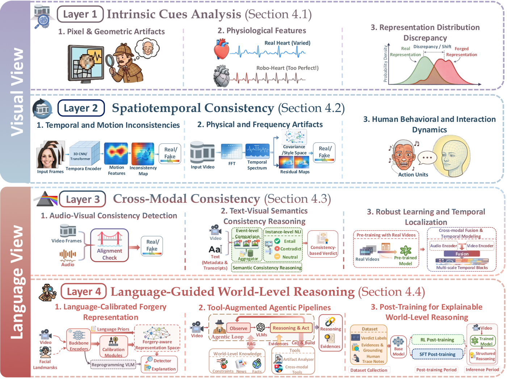
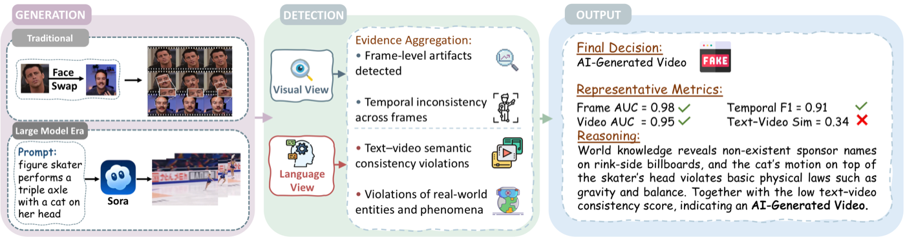
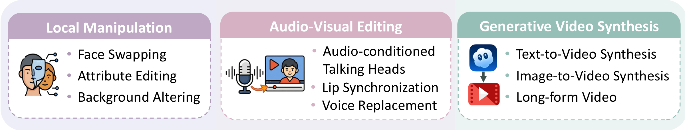
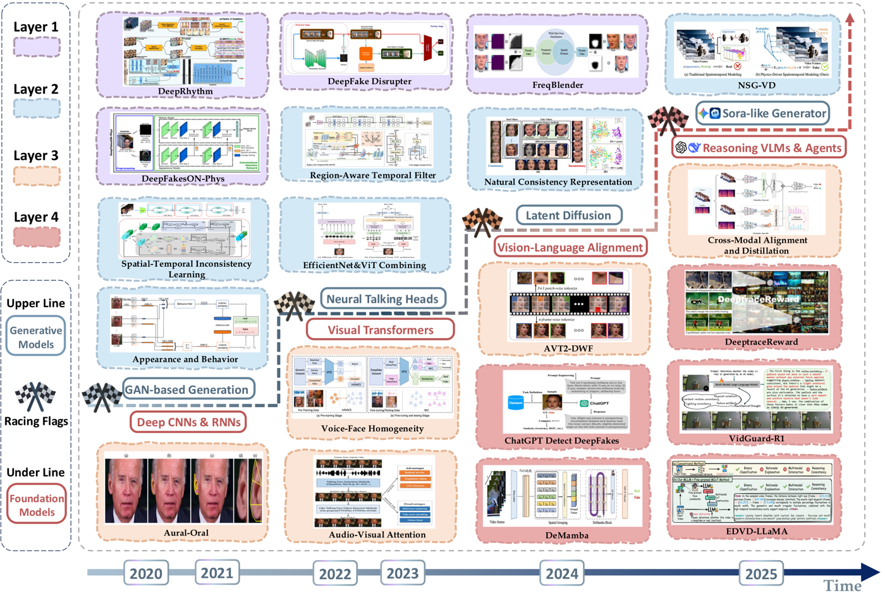

<h1 align="center">
  <strong>Awesome AI-Generated Video Detection</strong>
</h1>

<p align="center">
  <em>A curated, continuously updated collection of papers, benchmarks, and resources accompanying<br><strong>Detecting AI-Generated Video: A Vision–Language Dual-View Survey</strong>.</em>
</p>

<p align="center">
  <a href="https://aigcvdetection.github.io/">
    
  </a>
  <a href="https://arxiv.org/abs/2607.10787">
    
  </a>
  <a href="https://aclanthology.org/2026.findings-acl.1613.pdf">
    
  </a>
  <a href="#-timeline">
    
  </a>
  <a href="#-timeline">
    
  </a>
  <a href="https://github.com/dxhou/AI-Generated-Video-Detection/stargazers">
    
  </a>
  <a href="LICENSE">
    
  </a>
</p>

<p align="center">
  <a href="#-citation"><strong>Citation</strong></a> ·
  <a href="#-reading-guide"><strong>Reading Guide</strong></a> ·
  <a href="#-detection-map"><strong>Detection Map</strong></a> ·
  <a href="#-paper-list"><strong>Paper List</strong></a> ·
  <a href="#-contributing"><strong>Contributing</strong></a>
</p>

## 📢 Timeline

- [2026/07/20] 📚 We updated the video-first survey corpus and paper/benchmark index through **July 20, 2026**. The taxonomy table now contains **83 representative 2026 methods**, and every new entry was checked against its primary paper and, where applicable, an official venue page.
- [2026/07/20] 🌟 The repository now follows an **Awesome** venue-first reading-list format. Contributions that satisfy the video-first scope are welcome.
- [2026/06/14] 🎉 Our survey is accepted to **ICML 2026 EMM-QA Workshop**.
- [2026/04/07] 🎉 Our survey is accepted to **Findings of ACL 2026**.
- [2026/03/26] We release this repository for **Detecting AI-Generated Video: A Vision-Language Dual-View Survey**. More updates on papers, benchmarks, and resources will follow.

## 👋 Introduction

<div align="center">
  <a href="figures/dual-view.pdf">
    
  </a>
  <p><em><strong>Figure:</strong> Overview of the proposed <strong>Vision-Language Dual-View</strong> taxonomy, organizing AIGC-V detection from intrinsic visual cues to world-level reasoning.</em></p>
</div>

This repository reorganizes **"Detecting AI-Generated Video: A Vision-Language Dual-View Survey"** into a visual reading path, connecting the central taxonomy to the generation paradigms, detection methods, benchmarks, and paper list behind the survey.

The ACL Anthology version is available at [https://aclanthology.org/2026.findings-acl.1613.pdf](https://aclanthology.org/2026.findings-acl.1613.pdf). A local copy is also available in this repository at [paper/Detecting_AI_Generated_Video_A_Vision_Language_Dual_View_Survey.pdf](paper/Detecting_AI_Generated_Video_A_Vision_Language_Dual_View_Survey.pdf).

The evolving realism of **AI-Generated Content-Videos (AIGC-V)** is rapidly rendering traditional artifact-centric detection insufficient, driving a shift from low-level inspection to high-level semantic verification. In this survey, we reframe AIGC-V detection as **factual fidelity verification**: whether the events, entities, and physical processes depicted in a video remain consistent with real-world facts.

To systematize this fast-evolving area, we propose a **Vision-Language Dual-View** taxonomy that organizes methods into four layers: **(1) Intrinsic Cue Analysis**, **(2) Spatiotemporal Consistency**, **(3) Cross-Modal Consistency**, and **(4) Language-Guided World-Level Reasoning**. This framing highlights the transition from artifact matching in traditional deepfake detection to evidence-based semantic verification enabled by vision-language models and agentic reasoning pipelines. Based on a review of **298 video-centered works, updated through July 2026**, we synthesize AIGC-V generation paradigms, detection methods, evaluation metrics, benchmarks, and open challenges toward robust, explainable, and trustworthy detection.

<table>
  <tr>
    <td align="center" width="25%">
      <strong>298</strong><br>
      video-centered works
    </td>
    <td align="center" width="25%">
      <strong>4</strong><br>
      detection layers
    </td>
    <td align="center" width="25%">
      <strong>3</strong><br>
      generation settings
    </td>
    <td align="center" width="25%">
      <strong>4</strong><br>
      benchmark tracks
    </td>
  </tr>
</table>

## 📖 Citation

If you find this survey or repository helpful, please consider citing:

```bibtex
@inproceedings{Hou_2026,
   title={Detecting AI-Generated Video: A Vision–Language Dual-View Survey},
   url={http://dx.doi.org/10.18653/v1/2026.findings-acl.1613},
   DOI={10.18653/v1/2026.findings-acl.1613},
   booktitle={Findings of the Association for Computational Linguistics: ACL 2026},
   publisher={Association for Computational Linguistics},
   author={Hou, Dylan Xinming and Zhang, Juntian and Gu, Xu and Wu, Yichen and Lukas, Nils and Xia, Gus and Chen, Xiuying and Liu, Yuhan},
   year={2026},
   pages={32221–32255} }
```

## 🧭 Reading Guide

<table>
  <tr>
    <td valign="top" width="50%">
      <strong>🎬 Paradigms</strong><br>
      How AI-generated videos are produced across local manipulation, audio-visual editing, and full video synthesis.<br><br>
      <a href="paradigms/README.md">Overview</a> ·
      <a href="paradigms/README.md#local-manipulation">Local Manipulation</a> ·
      <a href="paradigms/README.md#audio-visual-editing">Audio-Visual Editing</a> ·
      <a href="paradigms/README.md#generative-video-synthesis">Generative Video Synthesis</a>
    </td>
    <td valign="top" width="50%">
      <strong>🧠 Methods</strong><br>
      How AIGC-V is detected, from intrinsic visual evidence to language-guided world-level reasoning across four layers.<br><br>
      <a href="methods/README.md">Overview</a> ·
      <a href="methods/layer-1-intrinsic-cues.md">L1</a> ·
      <a href="methods/layer-2-spatiotemporal.md">L2</a> ·
      <a href="methods/layer-3-cross-modal.md">L3</a> ·
      <a href="methods/layer-4-world-level-reasoning.md">L4</a>
    </td>
  </tr>
  <tr>
    <td valign="top" width="50%">
      <strong>🧪 Benchmarks</strong><br>
      Datasets, evaluation families, and diagnostic resources for both detection and explanation-oriented analysis.<br><br>
      <a href="benchmarks/README.md">Overview</a> ·
      <a href="benchmarks/local-manipulation-video.md">LMV</a> ·
      <a href="benchmarks/audio-visual-editing.md">AVE</a> ·
      <a href="benchmarks/generative-video-synthesis.md">GVS</a> ·
      <a href="benchmarks/adjacent-diagnostics.md">Adjacent Diagnostics</a>
    </td>
    <td valign="top" width="50%">
      <strong>📚 Paper List</strong><br>
      A flat, paper-first index spanning paradigms, methods, and benchmarks in the same style as a reference list.<br><br>
      <a href="#-paper-list">Jump to the full list</a>
    </td>
  </tr>
</table>

## 💡 Core Concepts

### 1. Problem Framing
<div align="center">
  <a href="figures/intro-fig.pdf">
    
  </a>
  <p><em><strong>Figure:</strong> An AIGC-V detection pipeline under the dual-view perspective, linking generated inputs, visual and language analysis, and outputs at different verification levels.</em></p>
</div>

AI-generated video detection is framed as **factual fidelity verification**: not only whether a clip is synthetic, but which claim, identity, event, or segment fails consistency. The operational view is expanded in [Detection methods](methods/README.md) and [Benchmarks and diagnostics](benchmarks/README.md).

### 2. AIGC-V Paradigms
<div align="center">
  <a href="figures/paradigms.pdf">
    
  </a>
  <p><em><strong>Figure:</strong> Taxonomy of AIGC-V generation paradigms, spanning local manipulation, audio-visual editing, and full generative video synthesis.</em></p>
</div>

The generation side is split into three settings: **[Local Manipulation](paradigms/README.md#local-manipulation)** edits parts of a real recorded video, **[Audio-Visual Editing](paradigms/README.md#audio-visual-editing)** changes speech-driven facial performance, and **[Generative Video Synthesis](paradigms/README.md#generative-video-synthesis)** creates the clip itself. The full taxonomy and representative systems are collected in the [Paradigms overview](paradigms/README.md).

### 3. Vision-Language Dual-View Taxonomy
The overview figure at the top of this page summarizes the taxonomy. It moves from what can be seen directly in frames and motion to what must be verified across modalities and against external knowledge. **Layers 1-2** focus on visual evidence inside the video, while **Layers 3-4** test whether speech, text, events, and implied claims remain mutually and externally consistent. The complete structure is summarized in the [Methods overview](methods/README.md) and expanded in [Layer 1](methods/layer-1-intrinsic-cues.md), [Layer 2](methods/layer-2-spatiotemporal.md), [Layer 3](methods/layer-3-cross-modal.md), and [Layer 4](methods/layer-4-world-level-reasoning.md).

### 4. Method Landscape
<div align="center">
  <a href="figures/landscape.pdf">
    
  </a>
  <p><em><strong>Figure:</strong> Method landscape showing the field's shift from artifact-centric screening toward multimodal consistency verification and world-grounded reasoning.</em></p>
</div>

The field is shifting from artifact-centric screening toward multimodal verification, grounded localization, and explainable reasoning as generators become stronger and more realistic. For a structured entry point, open the [Methods overview](methods/README.md), then connect it to the [Benchmarks overview](benchmarks/README.md), [Generative Video Synthesis benchmarks](benchmarks/generative-video-synthesis.md), and [Adjacent diagnostics](benchmarks/adjacent-diagnostics.md).

## 🗺️ Detection Map

The four layers below are arranged as a compact comparison table for faster scanning.

<table>
  <thead>
    <tr>
      <th align="left">Layer</th>
      <th align="left">Goal</th>
      <th align="left">Evidence</th>
      <th align="left">Best Fit</th>
      <th align="left">Boundary</th>
    </tr>
  </thead>
  <tbody>
    <tr>
      <td valign="top"><a href="methods/layer-1-intrinsic-cues.md"><strong>L1: Intrinsic Visual Cues</strong></a></td>
      <td valign="top">Test whether individual frames still look like captured video rather than synthesis, blending, or tampering.</td>
      <td valign="top">Frequency fingerprints, local texture artifacts, geometric inconsistencies, physiological traces, and distribution gaps.</td>
      <td valign="top">Fast screening and local-manipulation settings where traces survive inside the frame.</td>
      <td valign="top">Move to L2 when the failure is temporal formation rather than single-frame realism.</td>
    </tr>
    <tr>
      <td valign="top"><a href="methods/layer-2-spatiotemporal.md"><strong>L2: Spatiotemporal Consistency</strong></a></td>
      <td valign="top">Check whether motion, behavior, and physical transitions unfold like a real recorded sequence.</td>
      <td valign="top">Optical flow residuals, temporal frequency response, expression dynamics, interaction patterns, and physics-aware motion cues.</td>
      <td valign="top">Video-level verification when realism depends on motion continuity, scene dynamics, or long-range temporal coherence.</td>
      <td valign="top">Move to L3 when the key issue is no longer visual-only coherence but disagreement across modalities.</td>
    </tr>
    <tr>
      <td valign="top"><a href="methods/layer-3-cross-modal.md"><strong>L3: Cross-Modal Consistency</strong></a></td>
      <td valign="top">Test whether speech, lip motion, voice identity, captions, and visible events describe the same clip.</td>
      <td valign="top">Lip-sync alignment, voice-face consistency, text-video semantics, multimodal grounding, and temporal localization of mismatch.</td>
      <td valign="top">Audio-visual editing and multimodal misinformation settings where the failure is cross-modal contradiction.</td>
      <td valign="top">Move to L4 when within-video agreement is insufficient and outside facts or commonsense are needed.</td>
    </tr>
    <tr>
      <td valign="top"><a href="methods/layer-4-world-level-reasoning.md"><strong>L4: World-Level Reasoning</strong></a></td>
      <td valign="top">Judge whether the clip's implied claims remain plausible against external facts, commonsense, and structured evidence.</td>
      <td valign="top">Vision-language prompting, retrieval, tool-augmented reasoning, evidence chains, and explanation-oriented post-training.</td>
      <td valign="top">Full-video synthesis and high-realism cases where low-level artifacts fade but factual or causal consistency still breaks.</td>
      <td valign="top">The final layer, where verification depends on world knowledge rather than only what is visible inside the clip.</td>
    </tr>
  </tbody>
</table>

## 📚 Paper List

A flat, venue-first index with a consistent `Venue Year · title · links` pattern. Detailed notes and extra metadata stay on the linked section pages.

> **Venue policy.** Labels use a verified archival venue when available, `arXiv YYYY` when no archival venue is confirmed, and `Official release YYYY` for industry systems without a paper. First-public months remain in the detailed method and benchmark tables.

<!-- full-list:start -->
### [Paradigms](paradigms/README.md)

#### [Local Manipulation](paradigms/README.md#local-manipulation)
- **`arXiv 2025`** FakeParts: a New Family of AI-Generated DeepFakes. [[paper](https://arxiv.org/abs/2508.21052)]
- **`CIKM 2025`** FakeChain: Exposing Shallow Cues in Multi-Step Deepfake Detection. [[paper](https://doi.org/10.1145/3746252.3761345)]
- **`ICCV 2025`** DynamicFace: High-quality and consistent face swapping for image and video using composable 3D facial priors. [[paper](https://openaccess.thecvf.com/content/ICCV2025/html/Wang_DynamicFace_High-Quality_and_Consistent_Face_Swapping_for_Image_and_Video_ICCV_2025_paper.html)]
- **`NeurIPS 2024`** FuseAnyPart: Diffusion-Driven Facial Parts Swapping via Multiple Reference Images. [[paper](https://arxiv.org/abs/2410.22771)]

#### [Audio-Visual Editing](paradigms/README.md#audio-visual-editing)
- **`arXiv 2025`** SayAnything: Audio-Driven Lip Synchronization with Conditional Video Diffusion. [[paper](https://arxiv.org/abs/2502.11515)]
- **`arXiv 2025`** Audio-visual Controlled Video Diffusion with Masked Selective State Spaces Modeling for Natural Talking Head Generation. [[paper](https://arxiv.org/abs/2504.02542)]
- **`ACM MM 2025`** Ditto: Motion-Space Diffusion for Controllable Realtime Talking Head Synthesis. [[paper](https://arxiv.org/abs/2411.19509)]
- **`arXiv 2023`** GeneFace: Generalized and High-Fidelity Audio-Driven 3D Talking Face Synthesis. [[paper](https://arxiv.org/abs/2301.13430)]
- **`SIGGRAPH Asia 2022`** VideoReTalking: Audio-based Lip Synchronization for Talking Head Video Editing in the Wild. [[paper](https://arxiv.org/abs/2211.14758)]

#### [Generative Video Synthesis](paradigms/README.md#generative-video-synthesis)
- **`Official release 2026`** Official Launch of Seedance 2.0. [[paper](https://seed.bytedance.com/en/seedance2_0)]
- **`IJCV 2025`** Show-1: Marrying pixel and latent diffusion models for text-to-video generation. [[paper](https://doi.org/10.1007/s11263-024-02271-9)]
- **`Official release 2025`** Kling O1: Unified Multimodal Video Model. [[paper](https://app.klingai.com/global/)]
- **`Official release 2025`** Veo 3. [[paper](https://deepmind.google/models/veo/)]
- **`CVPR 2024`** Grid diffusion models for text-to-video generation. [[paper](https://doi.org/10.1109/cvpr52733.2024.00834)]
- **`Official release 2024`** Sora 2. [[paper](https://openai.com/sora/)]
- **`Official release 2024`** Introducing Gen-3 Alpha: A New Frontier for Video Generation. [[paper](https://runwayml.com/research/introducing-gen-3-alpha)]
- **`Official release 2024`** Dream Machine. [[paper](https://lumalabs.ai/dream-machine)]
- **`ICCV 2023`** Scalable Diffusion Models with Transformers. [[paper](https://openaccess.thecvf.com/content/ICCV2023/papers/Peebles_Scalable_Diffusion_Models_with_Transformers_ICCV_2023_paper.pdf)]
- **`arXiv 2022`** Video Diffusion Models. [[paper](https://arxiv.org/abs/2204.03458)]
- **`arXiv 2022`** Imagen Video: High Definition Video Generation with Diffusion Models. [[paper](https://arxiv.org/abs/2210.02303)]
- **`arXiv 2022`** Make-A-Video: Text-to-Video Generation without Text-Video Data. [[paper](https://arxiv.org/abs/2209.14792)]

### [Layer 1: Intrinsic Visual Cues](methods/layer-1-intrinsic-cues.md)

#### [A. Pixel and geometric artifacts](methods/layer-1-intrinsic-cues.md#a-pixel-and-geometric-artifacts)
- **`arXiv 2026`** Lightweight Complementary-Cue Fusion for Robust Video Face Forgery Detection. [[paper](https://arxiv.org/abs/2605.29092)]
- **`arXiv 2026`** SpecSem-Net: Integrating Spectral and Semantic Features for Robust AI-Generated Video Detection. [[paper](https://arxiv.org/abs/2605.17311)]
- **`NeurIPS 2024`** Freqblender: Enhancing deepfake detection by blending frequency knowledge. [[paper](https://arxiv.org/abs/2404.13872)]
- **`ECCV 2024`** Real appearance modeling for more general deepfake detection. [[paper](https://doi.org/10.1007/978-3-031-72943-0_23)]
- **`CVPR 2024`** Beyond deepfake images: Detecting ai-generated videos. [[paper](https://doi.org/10.1109/cvprw63382.2024.00443)]
- **`AAAI 2023`** Noise based deepfake detection via multi-head relative-interaction. [[paper](https://doi.org/10.1609/aaai.v37i12.26701)]
- **`ECCV 2022`** Hierarchical contrastive inconsistency learning for deepfake video detection. [[paper](https://doi.org/10.1007/978-3-031-19775-8_35)]
- **`CVPR 2021`** MagDR: Mask-Guided Detection and Reconstruction for Defending Deepfakes. [[paper](https://openaccess.thecvf.com/content/CVPR2021/html/Chen_MagDR_Mask-Guided_Detection_and_Reconstruction_for_Defending_Deepfakes_CVPR_2021_paper.html)]
- **`CVPR 2021`** Improving the efficiency and robustness of deepfakes detection through precise geometric features. [[paper](https://doi.org/10.1109/cvpr46437.2021.00361)]
- **`ICASSP 2019`** Exposing deep fakes using inconsistent head poses. [[paper](https://doi.org/10.1109/icassp.2019.8683164)]

#### [B. Physiological features](methods/layer-1-intrinsic-cues.md#b-physiological-features)
- **`The Visual Computer 2024`** Local attention and long-distance interaction of rPPG for deepfake detection. [[paper](https://doi.org/10.1007/s00371-023-02833-x)]
- **`arXiv 2022`** Visual Representations of Physiological Signals for Fake Video Detection. [[paper](https://arxiv.org/abs/2207.08380)]
- **`arXiv 2021`** Exposing deepfake with pixel-wise ar and ppg correlation from faint signals. [[paper](https://arxiv.org/abs/2110.15561)]
- **`ICTC 2021`** A study on effective use of bpm information in deepfake detection. [[paper](https://doi.org/10.1109/ictc52510.2021.9621186)]
- **`ACM MM 2020`** Deeprhythm: Exposing deepfakes with attentional visual heartbeat rhythms. [[paper](https://arxiv.org/abs/2006.07634)]
- **`arXiv 2020`** Deepfakeson-phys: Deepfakes detection based on heart rate estimation. [[paper](https://arxiv.org/abs/2010.00400)]
- **`IJCB 2020`** How do the hearts of deep fakes beat? Deep fake source detection via interpreting residuals with biological signals. [[paper](https://doi.org/10.1109/ijcb48548.2020.9304909)]
- **`IEEE TPAMI 2020`** Fakecatcher: Detection of synthetic portrait videos using biological signals. [[paper](https://doi.org/10.1109/tpami.2020.3009287)]
- **`ICCVW 2019`** Predicting Heart Rate Variations of Deepfake Videos using Neural ODE. [[paper](https://doi.org/10.1109/ICCVW.2019.00213)]
- **`WIFS 2018`** In ictu oculi: Exposing ai created fake videos by detecting eye blinking. [[paper](https://doi.org/10.1109/wifs.2018.8630787)]

#### [C. Distribution discrepancy and robustness](methods/layer-1-intrinsic-cues.md#c-distribution-discrepancy-and-robustness)
- **`arXiv 2026`** G2VD: Generalizable AI-Generated Video Detection via Counterfactual Intervention and Causal Disentanglement. [[paper](https://arxiv.org/abs/2607.04607)]
- **`arXiv 2026`** CUPID: Reconstructing UV Texture Maps for Interpretable Person-of-Interest Deepfake Detection. [[paper](https://arxiv.org/abs/2606.20302)]
- **`ACM IH&MMSec 2026`** Seeing the Unseen: Enhancing Synthetic Video Detector Transferability to New AI Video Generation Models via Virtual Generators. [[paper](https://doi.org/10.1145/3785353.3815083)]
- **`CVPRW 2026`** Forensic Rewiring: Circuit-Level Shortcut Suppression for Generalizable Deepfake Detection. [[paper](https://openaccess.thecvf.com/content/CVPR2026W/AIMS/html/A_Forensic_Rewiring_Circuit-Level_Shortcut_Suppression_for_Generalizable_Deepfake_Detection_CVPRW_2026_paper.html)]
- **`CVPR 2026`** DFD-HR: Generalizable Deepfake Detection via Hierarchical Routing Learning. [[paper](https://openaccess.thecvf.com/content/CVPR2026/html/Sun_DFD-HR_Generalizable_Deepfake_Detection_via_Hierarchical_Routing_Learning_CVPR_2026_paper.html)]
- **`CVPR 2026`** Beyond [CLS] Token: Query-Driven Token-Level Forgery Purification for Generalizable Deepfake Detection. [[paper](https://openaccess.thecvf.com/content/CVPR2026/html/Wang_Beyond_CLS_Token_Query-Driven_Token-Level_Forgery_Purification_for_Generalizable_Deepfake_Detection_CVPR_2026_paper.html)]
- **`CVPR 2026`** Tutor-Student Reinforcement Learning: A Dynamic Curriculum for Robust Deepfake Detection. [[paper](https://openaccess.thecvf.com/content/CVPR2026/html/Lei_Tutor-Student_Reinforcement_Learning_A_Dynamic_Curriculum_for_Robust_Deepfake_Detection_CVPR_2026_paper.html)]
- **`ICML 2026`** Real Data Lies: Unveiling and Closing the Quality Shortcut in Generalizable AI-Generated Video Detection. [[paper](https://icml.cc/virtual/2026/poster/61218)]
- **`arXiv 2026`** Video as Natural Augmentation: Towards Unified AI-Generated Image and Video Detection. [[paper](https://arxiv.org/abs/2605.21977)]
- **`ICDF2C 2025`** Deepfake Forensics Adapter: A Dual-Stream Network for Generalizable Deepfake Detection. [[paper](https://doi.org/10.48550/ARXIV.2603.01450)]
- **`WACV 2026`** Deepfake Detection that Generalizes Across Benchmarks. [[paper](https://openaccess.thecvf.com/content/WACV2026/papers/Yermakov_Deepfake_Detection_that_Generalizes_Across_Benchmarks_WACV_2026_paper.pdf)]
- **`NeurIPS 2024`** Can we leave deepfake data behind in training deepfake detector? [[paper](https://doi.org/10.52202/079017-0691)]
- **`ECCV 2024`** Fake It till You Make It: Curricular Dynamic Forgery Augmentations Towards General Deepfake Detection. [[paper](https://doi.org/10.1007/978-3-031-73016-0_7)]
- **`CVPR 2024`** Transcending Forgery Specificity with Latent Space Augmentation for Generalizable Deepfake Detection. [[paper](https://doi.org/10.1109/CVPR52733.2024.00858)]
- **`CVPR 2024`** Exploiting style latent flows for generalizing deepfake video detection. [[paper](https://doi.org/10.1109/cvpr52733.2024.00114)]
- **`arXiv 2024`** Turns Out I'm Not Real: Towards Robust Detection of AI-Generated Videos. [[paper](https://arxiv.org/abs/2406.09601)]
- **`ICCV 2023`** Seeable: Soft discrepancies and bounded contrastive learning for exposing deepfakes. [[paper](https://doi.org/10.1109/iccv51070.2023.01921)]
- **`ICCV 2023`** Quality-agnostic deepfake detection with intra-model collaborative learning. [[paper](https://doi.org/10.1109/iccv51070.2023.02045)]
- **`NeurIPS 2022`** Ost: Improving generalization of deepfake detection via one-shot test-time training. [[paper](https://doi.org/10.52202/068431-1786)]
- **`CIKM 2020`** Towards generalizable deepfake detection with locality-aware autoencoder. [[paper](https://doi.org/10.1145/3340531.3411892)]

### [Layer 2: Spatiotemporal Consistency](methods/layer-2-spatiotemporal.md)

#### [A. Temporal and motion inconsistencies](methods/layer-2-spatiotemporal.md#a-temporal-and-motion-inconsistencies)
- **`CVPR 2026`** SAGA: Source Attribution of Generative AI Videos. [[paper](https://openaccess.thecvf.com/content/CVPR2026/html/Kundu_SAGA_Source_Attribution_of_Generative_AI_Videos_CVPR_2026_paper.html)]
- **`CVPR 2026`** Training-Free Detection of Generated Videos via Spatial-Temporal Likelihoods. [[paper](https://openaccess.thecvf.com/content/CVPR2026/html/Hayun_Training-free_Detection_of_Generated_Videos_via_Spatial-Temporal_Likelihoods_CVPR_2026_paper.html)]
- **`Expert Systems with Applications 2026`** Robust Deepfake Detection in Compressed Videos with Scalable Network Strategies. [[paper](https://doi.org/10.1016/j.eswa.2026.131761)]
- **`Scientific Reports 2026`** A Spatiotemporal Defect-Integrated Deepfake Video Detection and Forgery Algorithm Attribution Model. [[paper](https://doi.org/10.1038/s41598-026-55334-x)]
- **`IEEE TCSVT 2026`** Robust AI-Generated Video Detection via Color-Agnostic Contrastive Curriculum Learning with Color-Aware Feature Modulation. [[paper](https://doi.org/10.1109/TCSVT.2026.3701354)]
- **`Discover AI 2026`** A Novel Temporal Attention Regularization Loss for Robust and Explainable Deepfake Detection. [[paper](https://doi.org/10.1007/s44163-026-01784-1)]
- **`arXiv 2026`** Rethinking the Readout: Unlocking Video Backbones for AI-Generated Video Detection. [[paper](https://arxiv.org/abs/2607.15321)]
- **`ECCV 2026 (author-reported)`** SPLIT: Training-Free AI-Generated and Partially Edited Video Detection via Spatial Patch-Level Incoherence and Temporal Roughness. [[paper](https://arxiv.org/abs/2607.02886)]
- **`ICME 2026 (author-reported)`** LoCC: Detection and Localization of Lip-Syncing Deepfakes via Counterfactual Frame Consistency. [[paper](https://arxiv.org/abs/2606.22772)]
- **`CVPRW 2026`** From Detector Evidence to Language: Explainable Deepfake Video Detection. [[paper](https://openaccess.thecvf.com/content/CVPR2026W/FoundGen-Bio/html/Panahi_From_Detector_Evidence_to_Language_Explainable_Deepfake_Video_Detection_CVPRW_2026_paper.html)]
- **`arXiv 2026`** ReConFuse: Reconstruction-Error Guided Semantic Fusion for AI-Generated Video Detection. [[paper](https://arxiv.org/abs/2606.04706)]
- **`arXiv 2026`** Scalable, Energy-Efficient Optical-Neural Architecture for Multiplexed Deepfake Video Detection. [[paper](https://arxiv.org/abs/2605.19360)]
- **`arXiv 2026`** CAM-VFD: Cross-Attention Multimodal Video Forgery Detection. [[paper](https://arxiv.org/abs/2605.17133)]
- **`arXiv 2026`** Detecting AI-Generated Videos with Spiking Neural Networks. [[paper](https://arxiv.org/abs/2605.05895)]
- **`arXiv 2026`** DYMAPIA: A Multi-Domain Framework for Detecting AI-Based Video Manipulation. [[paper](https://arxiv.org/abs/2604.24426)]
- **`ICASSP 2026`** Towards Robust Cross-Compression Deepfake Detection. [[paper](https://doi.org/10.1109/ICASSP55912.2026.11462676)]
- **`ICLR 2026`** Preserving Forgery Artifacts: AI-Generated Video Detection at Native Scale. [[paper](https://openreview.net/forum?id=XD43lfRCg6)]
- **`WACV 2026`** SVD-Det: A Lightweight Framework for Video Forgery Detection Using Semantic and Visual Defect Cues. [[paper](https://openaccess.thecvf.com/content/WACV2026/html/Yang_SVD-Det_A_Lightweight_Framework_for_Video_Forgery_Detection_Using_Semantic_WACV_2026_paper.html)]
- **`WACV 2026`** Training-free Detection of Text-to-video Generations via Over-coherence. [[paper](https://openaccess.thecvf.com/content/WACV2026/html/Brokman_Training-free_Detection_of_Text-to-video_Generations_via_Over-coherence_WACV_2026_paper.html)]
- **`Neurocomputing 2026`** Detecting AI-Generated Videos via Global Semantic Awareness and Inter-Frame Semantic Consistency. [[paper](https://doi.org/10.1016/j.neucom.2026.133530)]
- **`Signal Processing: Image Communication 2026`** 3D Differential Decomposition for Video Deepfake Detection with Identity Suppression. [[paper](https://doi.org/10.1016/j.image.2026.117525)]
- **`IEEE Access 2026`** Beyond Frames: 3D-CoAtNet for Generalizable Deepfake Video Detection. [[paper](https://doi.org/10.1109/ACCESS.2026.3666623)]
- **`IEEE TBIOM 2026`** Dual Frequency-Guided Spatiotemporal Feature Learning for Face Forgery Detection. [[paper](https://doi.org/10.1109/TBIOM.2025.3646181)]
- **`Knowledge-Based Systems 2026`** CAST: Cross-Attentive Spatio-Temporal Feature Fusion for Deepfake Detection. [[paper](https://doi.org/10.1016/j.knosys.2026.115560)] [[arXiv](https://arxiv.org/abs/2506.21711)]
- **`ICME 2025`** GC-ConsFlow: Leveraging Optical Flow Residuals and Global Context for Robust Deepfake Detection. [[paper](https://arxiv.org/abs/2501.13435)]
- **`CVPR 2025`** Generalizing deepfake video detection with plug-and-play: Video-level blending and spatiotemporal adapter tuning. [[paper](https://doi.org/10.1109/cvpr52734.2025.01177)]
- **`arXiv 2025`** Vulnerability-Aware Spatio-Temporal Learning for Generalizable and Interpretable Deepfake Video Detection. [[paper](https://arxiv.org/abs/2501.01184)]
- **`ECCV 2024`** Learning natural consistency representation for face forgery video detection. [[paper](https://doi.org/10.1007/978-3-031-73010-8_24)]
- **`IJCV 2024`** Learning spatiotemporal inconsistency via thumbnail layout for face deepfake detection. [[paper](https://doi.org/10.1007/s11263-024-02054-2)]
- **`ICME 2025`** Decof: Generated video detection via frame consistency. [[paper](https://arxiv.org/abs/2402.02085)]
- **`IEEE TIFS 2023`** Dynamic difference learning with spatio--temporal correlation for deepfake video detection. [[paper](https://doi.org/10.1109/tifs.2023.3290752)]
- **`ICCV 2023`** Tall: Thumbnail layout for deepfake video detection. [[paper](https://doi.org/10.1109/iccv51070.2023.02071)]
- **`IJCAI 2022`** Region-Aware Temporal Inconsistency Learning for DeepFake Video Detection. [[paper](https://doi.org/10.24963/ijcai.2022/129)]
- **`ICIAP 2022`** Combining efficientnet and vision transformers for video deepfake detection. [[paper](https://doi.org/10.1007/978-3-031-06433-3_19)]
- **`AAAI 2022`** Delving into the local: Dynamic inconsistency learning for deepfake video detection. [[paper](https://doi.org/10.1609/aaai.v36i1.19955)]
- **`ACM MM 2021`** Spatiotemporal inconsistency learning for deepfake video detection. [[paper](https://doi.org/10.1145/3474085.3475508)]
- **`IJCAI 2021`** Detecting Deepfake Videos with Temporal Dropout 3DCNN. [[paper](https://doi.org/10.24963/ijcai.2021/178)]
- **`IJCAI 2021`** Dynamic Inconsistency-aware DeepFake Video Detection. [[paper](https://doi.org/10.24963/ijcai.2021/102)]
- **`WACV 2021`** Interpretable and trustworthy deepfake detection via dynamic prototypes. [[paper](https://doi.org/10.1109/wacv48630.2021.00202)]
- **`ECCV 2020`** Two-branch recurrent network for isolating deepfakes in videos. [[paper](https://doi.org/10.1007/978-3-030-58571-6_39)]
- **`ACM MM 2020`** Sharp multiple instance learning for deepfake video detection. [[paper](https://doi.org/10.1145/3394171.3414034)]
- **`ICME 2020`** Fsspotter: Spotting face-swapped video by spatial and temporal clues. [[paper](https://doi.org/10.1109/icme46284.2020.9102914)]

#### [B. Physical and frequency artifacts](methods/layer-2-spatiotemporal.md#b-physical-and-frequency-artifacts)
- **`arXiv 2026`** Revealing Artifacts via Noise Amplification: A Novel Perspective for AI-Generated Video Detection. [[paper](https://arxiv.org/abs/2606.16742)]
- **`ISWA 2026`** VIDS-Guard: A Novel Forensics-Aware Multi-Stream Transformer Framework for Robust Deepfake Video Detection. [[paper](https://doi.org/10.1016/j.iswa.2026.200664)]
- **`arXiv 2026`** Exposing and Mitigating Temporal Attack in Deepfake Video Detection. [[paper](https://arxiv.org/abs/2605.07398)]
- **`ICML 2026`** Beyond Pixels: Mining Compressed Domain Artifacts for Efficient AI-Generated Video Detection. [[paper](https://icml.cc/virtual/2026/poster/62999)]
- **`arXiv 2026`** Aletheia: Physics-Conditioned Localized Artifact Attention (PhyLAA-X) for End-to-End Generalizable and Robust Deepfake Video Detection. [[paper](https://arxiv.org/abs/2604.16486)]
- **`ICASSP 2026`** Deep Video Frame Interpolation Detection Via Event-Guided Temporal Analysis and High-Frequency Artifacts. [[paper](https://doi.org/10.1109/ICASSP55912.2026.11460758)]
- **`ECCV 2026 (author-reported)`** Moiré Video Authentication: A Physical Signature Against AI Video Generation. [[paper](https://arxiv.org/abs/2604.01654)]
- **`arXiv 2026`** MPF-Net: Exposing High-Fidelity AI-Generated Video Forgeries via Hierarchical Manifold Deviation and Micro-Temporal Fluctuations. [[paper](https://doi.org/10.48550/ARXIV.2601.21408)]
- **`ICCV 2025`** D3: Training-Free AI-Generated Video Detection Using Second-Order Features. [[paper](https://openaccess.thecvf.com/content/ICCV2025/html/Zheng_D3_Training-Free_AI-Generated_Video_Detection_Using_Second-Order_Features_ICCV_2025_paper.html)]
- **`NeurIPS 2025`** Physics-Driven Spatiotemporal Modeling for AI-Generated Video Detection. [[paper](https://openreview.net/forum?id=HiBoJLCyEo)]
- **`NeurIPS 2025`** AI-Generated Video Detection via Perceptual Straightening. [[paper](https://openreview.net/forum?id=LsmUgStXby)]
- **`arXiv 2025`** Beyond Spatial Frequency: Pixel-wise Temporal Frequency-based Deepfake Video Detection. [[paper](https://arxiv.org/abs/2507.02398)]
- **`arXiv 2025`** Leveraging Pre-Trained Visual Models for AI-Generated Video Detection. [[paper](https://arxiv.org/abs/2507.13224)]
- **`arXiv 2025`** De-Fake: Style based Anomaly Deepfake Detection. [[paper](https://arxiv.org/abs/2507.03334)]
- **`arXiv 2025`** Seeing What Matters: Generalizable AI-generated Video Detection with Forensic-Oriented Augmentation. [[paper](https://arxiv.org/abs/2506.16802)]
- **`arXiv 2025`** VoD: Learning Volume of Differences for Video-Based Deepfake Detection. [[paper](https://arxiv.org/abs/2503.07607)]
- **`WACV 2025`** DiffFake: Exposing Deepfakes using Differential Anomaly Detection. [[paper](https://doi.org/10.1109/wacvw65960.2025.00079)]
- **`IEEE TMM 2024`** DIP: diffusion learning of inconsistency pattern for general deepfake detection. [[paper](https://doi.org/10.1109/tmm.2024.3521766)]
- **`arXiv 2024`** A quality-centric framework for generic deepfake detection. [[paper](https://arxiv.org/abs/2411.05335)]
- **`CVPRW 2020`** Towards untrusted social video verification to combat deepfakes via face geometry consistency. [[paper](https://doi.org/10.1109/cvprw50498.2020.00335)]

#### [C. Human behavioral and interaction dynamics](methods/layer-2-spatiotemporal.md#c-human-behavioral-and-interaction-dynamics)
- **`CVPR 2026`** Learning Forgery-Aware Lip Representations Without Forgery Priors. [[paper](https://openaccess.thecvf.com/content/CVPR2026/html/Chen_Learning_Forgery-Aware_Lip_Representations_Without_Forgery_Priors_CVPR_2026_paper.html)]
- **`arXiv 2026`** Interpretable Facial Dynamics as Behavioral and Perceptual Traces of Deepfakes. [[paper](https://arxiv.org/abs/2604.21760)]
- **`arXiv 2026`** BioLip: Language-Generalizable Lip-Sync Deepfake Detection via Biomechanical Constraint Violation Modeling. [[paper](https://arxiv.org/abs/2604.16808)]
- **`arXiv 2025`** DeepFake Detection in Dyadic Video Calls using Point of Gaze Tracking. [[paper](https://arxiv.org/abs/2509.25503)]
- **`WACVW 2026`** Detecting Deepfake Talking Heads from Facial Biometric Anomalies. [[paper](https://openaccess.thecvf.com/content/WACV2026W/SAFE-2026/html/Norman_Detecting_Deepfake_Talking_Heads_from_Facial_Biometric_Anomalies_WACVW_2026_paper.html)]
- **`arXiv 2025`** When Deepfake Detection Meets Graph Neural Network: a Unified and Lightweight Learning Framework. [[paper](https://arxiv.org/abs/2508.05526)]
- **`CVPR 2025`** Detecting Localized Deepfake Manipulations Using Action Unit-Guided Video Representations. [[paper](https://doi.org/10.1109/cvprw67362.2025.00419)]
- **`IEEE TCSVT 2023`** Exploiting complementary dynamic incoherence for deepfake video detection. [[paper](https://doi.org/10.1109/tcsvt.2023.3238517)]
- **`CVPR 2021`** Lips Don't Lie: A Generalisable and Robust Approach To Face Forgery Detection. [[paper](https://doi.org/10.1109/cvpr46437.2021.00500)]
- **`WIFS 2020`** Detecting deep-fake videos from appearance and behavior. [[paper](https://doi.org/10.1109/wifs49906.2020.9360904)]
- **`arXiv 2020`** Identity-driven deepfake detection. [[paper](https://arxiv.org/abs/2012.03930)]
- **`arXiv 2020`** Emotions Don't Lie: An Audio-Visual Deepfake Detection Method Using Affective Cues. [[paper](https://arxiv.org/abs/2003.06711)]

### [Layer 3: Cross-Modal Consistency](methods/layer-3-cross-modal.md)

#### [A. Audio-visual consistency detection](methods/layer-3-cross-modal.md#a-audio-visual-consistency-detection)
- **`PRCV 2025 (LNCS 2026)`** Towards Highly Generalized Lip-Sync Deepfake Detection via Detailed Audio-Visual Inconsistency Analysis. [[paper](https://doi.org/10.1007/978-981-95-5740-0_36)]
- **`Knowledge-Based Systems 2026`** AMID: Audio-Visual Deepfake Detection via Adaptive Multi-Dimensional Interaction Modeling. [[paper](https://doi.org/10.1016/j.knosys.2026.116214)]
- **`IEEE TCSVT 2026`** AVIR: Audio-Visual Information Refinement for Robust Multimodal Deepfake Detection. [[paper](https://doi.org/10.1109/TCSVT.2026.3691216)]
- **`arXiv 2026`** Leave No Stone Unturned: Uncovering Holistic Audio-Visual Intrinsic Coherence for Deepfake Detection. [[paper](https://arxiv.org/abs/2603.23960)]
- **`IEEE TCSS 2026`** VATS: Visual-Audio Multitask Transformer With Specialty Audio Encoder for Multimodal Deepfake Detection in CPSS. [[paper](https://doi.org/10.1109/TCSS.2026.3659182)]
- **`Neurocomputing 2026`** AVSCNet: A Dual-Branch Network for Synchronization Detection and Content Consistency Learning in Audio-Video Forgery Detection. [[paper](https://doi.org/10.1016/j.neucom.2026.133067)]
- **`Neural Networks 2026`** Emotion-Aware Multimodal Deepfake Detection. [[paper](https://doi.org/10.1016/j.neunet.2026.108675)]
- **`arXiv 2026`** Teacher--Student Structure for Domain Adaptation in Ensemble Audio--Visual Video Deepfake Detection. [[paper](https://arxiv.org/abs/2606.15117)]
- **`SAFE@CVPRW 2026`** EMO-BOOST: Emotion-Augmented Audio-Visual Features for Improved Generalization in Deepfake Detection. [[paper](https://arxiv.org/abs/2605.19630)]
- **`ICML 2026`** From Talking to Singing: A New Challenge for Audio-Visual Deepfake Detection. [[paper](https://icml.cc/virtual/2026/poster/62663)]
- **`arXiv 2026`** Are DeepFakes Realistic Enough? Exploring Semantic Mismatch as a Novel Challenge. [[paper](https://arxiv.org/abs/2604.28022)]
- **`arXiv 2026`** Attribution-Guided Multimodal Deepfake Detection via Cross-Modal Forensic Fingerprints. [[paper](https://arxiv.org/abs/2604.26453)]
- **`arXiv 2026`** Listening Deepfake Detection: A New Perspective Beyond Speaking-Centric Forgery Analysis. [[paper](https://arxiv.org/abs/2604.12650)]
- **`arXiv 2026`** Generalizing Video DeepFake Detection by Self-Generated Audio-Visual Pseudo-Fakes. [[paper](https://arxiv.org/abs/2604.09110)]
- **`ICASSP 2026`** MSCT: Differential Cross-Modal Attention for Deepfake Detection. [[paper](https://doi.org/10.1109/ICASSP55912.2026.11460824)] [[arXiv](https://arxiv.org/abs/2604.07741)]
- **`ICASSP 2026`** AVATAR: Audio-Visual Adaptive Fusion via Trained Agent Reinforcement for Multimodal Deepfake Detection. [[paper](https://doi.org/10.1109/ICASSP55912.2026.11464081)]
- **`ICASSP 2026`** HybridMask: Facial-Guided Cross-Modal Fusion for Multimodal Deepfake Detection. [[paper](https://doi.org/10.1109/ICASSP55912.2026.11462311)]
- **`CVPR 2026`** X-AVDT: Audio-Visual Cross-Attention for Robust Deepfake Detection. [[paper](https://openaccess.thecvf.com/content/CVPR2026/html/Kim_X-AVDT_Audio-Visual_Cross-Attention_for_Robust_Deepfake_Detection_CVPR_2026_paper.html)]
- **`ICASSP 2026`** Leveraging Large Multimodal Models for Audio-Video Deepfake Detection: A Pilot Study. [[paper](https://doi.org/10.1109/ICASSP55912.2026.11463461)] [[arXiv](https://arxiv.org/abs/2602.23393)]
- **`Findings of EACL 2026`** Revealing the Truth with ConLLM for Detecting Multi-Modal Deepfakes. [[paper](https://doi.org/10.48550/ARXIV.2601.17530)]
- **`CVPR 2026`** Investigating Self-Supervised Representations for Audio-Visual Deepfake Detection. [[paper](https://openaccess.thecvf.com/content/CVPR2026/html/Boldisor_Investigating_Self-Supervised_Representations_for_Audio-Visual_Deepfake_Detection_CVPR_2026_paper.html)]
- **`IEEE TIFS 2026`** Toward Generalizable Deepfake Detection via Forgery-Aware Audio-Visual Adaptation: A Variational Bayesian Approach. [[paper](https://doi.org/10.1109/TIFS.2026.3673104)]
- **`Information Fusion 2026`** Improving Deepfake Detection with Predictive Inter-Modal Alignment and Feature Reconstruction in Audio-Visual Asynchrony Scenarios. [[paper](https://doi.org/10.1016/j.inffus.2025.103708)]
- **`IEEE TIFS 2026`** FauForensics: Boosting Audio-Visual Deepfake Detection With Facial Action Units. [[paper](https://doi.org/10.1109/TIFS.2026.3674401)]
- **`arXiv 2025`** PIA: Deepfake Detection Using Phoneme-Temporal and Identity-Dynamic Analysis. [[paper](https://arxiv.org/abs/2510.14241)]
- **`ACM MM 2025`** KLASSify to Verify: Audio-Visual Deepfake Detection Using SSL-based Audio and Handcrafted Visual Features. [[paper](https://arxiv.org/abs/2508.07337)]
- **`arXiv 2025`** CAD: A General Multimodal Framework for Video Deepfake Detection via Cross-Modal Alignment and Distillation. [[paper](https://arxiv.org/abs/2505.15233)]
- **`AAAI 2025`** Multi-modal deepfake detection via multi-task audio-visual prompt learning. [[paper](https://doi.org/10.1609/aaai.v39i1.32042)]
- **`CVPRW 2024`** Lost in Translation: Lip-Sync Deepfake Detection from Audio-Video Mismatch. [[paper](https://doi.org/10.1109/cvprw63382.2024.00435)]
- **`CVPR 2024`** AVFF: Audio-Visual Feature Fusion for Video Deepfake Detection. [[paper](https://arxiv.org/abs/2406.02951)]
- **`Interspeech 2024`** Zero-Shot Fake Video Detection by Audio-Visual Consistency. [[paper](https://arxiv.org/abs/2406.07854)]
- **`ACM TOMM 2023`** Voice-Face Homogeneity Tells Deepfake. [[paper](https://arxiv.org/abs/2203.02195)]
- **`IEEE URTC 2023`** Integrating Audio-Visual Features for Multimodal Deepfake Detection. [[paper](https://arxiv.org/abs/2310.03827)]
- **`APSIPA ASC 2022`** Lip Sync Matters: A Novel Multimodal Forgery Detector. [[paper](https://doi.org/10.23919/APSIPAASC55919.2022.9980296)]
- **`CVPRW 2023`** Audio-Visual Person-of-Interest DeepFake Detection. [[paper](https://arxiv.org/abs/2204.03083)]
- **`arXiv 2022`** An Audio-Visual Attention Based Multimodal Network for Fake Talking Face Videos Detection. [[paper](https://arxiv.org/abs/2203.05178)]
- **`ICCV 2021`** Joint Audio-Visual Deepfake Detection. [[paper](https://doi.org/10.1109/ICCV48922.2021.01453)]
- **`ICME 2021`** DeepFake Videos Detection Using Self-Supervised Decoupling Network. [[paper](https://doi.org/10.1109/ICME51207.2021.9428368)]
- **`CVPRW 2021`** Detecting Deep-Fake Videos From Aural and Oral Dynamics. [[paper](https://doi.org/10.1109/cvprw53098.2021.00109)]
- **`IEEE TIFS 2021`** Preventing DeepFake Attacks on Speaker Authentication by Dynamic Lip Movement Analysis. [[paper](https://api.semanticscholar.org/CorpusID:230998982)]
- **`ACM MM 2020`** Not made for each other- Audio-Visual Dissonance-based Deepfake Detection and Localization. [[paper](https://doi.org/10.1145/3394171.3413700)]

#### [B. Text-video semantic consistency reasoning](methods/layer-3-cross-modal.md#b-text-video-semantic-consistency-reasoning)
- **`Future Internet 2026`** Video Deepfake Detection Based on Multimodality Semantic Consistency Fusion. [[paper](https://doi.org/10.3390/fi18020067)]
- **`arXiv 2026`** CMTA: Leveraging Cross-Modal Temporal Artifacts for Generalizable AI-Generated Video Detection. [[paper](https://arxiv.org/abs/2605.00630)]
- **`arXiv 2026`** ATSS: Detecting AI-Generated Videos via Anomalous Temporal Self-Similarity. [[paper](https://arxiv.org/abs/2604.04029)]
- **`arXiv 2025`** T^3SVFND: Towards an Evolving Fake News Detector for Emergencies with Test-time Training on Short Video Platforms. [[paper](https://arxiv.org/abs/2507.20286)]
- **`CVPR 2025`** Unleashing the Potential of Consistency Learning for Detecting and Grounding Multi-Modal Media Manipulation. [[paper](https://arxiv.org/abs/2506.05890)]
- **`arXiv 2025`** Consistency-aware Fake Videos Detection on Short Video Platforms. [[paper](https://arxiv.org/abs/2504.21495)]

#### [C. Robust learning and temporal localization](methods/layer-3-cross-modal.md#c-robust-learning-and-temporal-localization)
- **`CVPR 2026`** GEM-TFL: Bridging Weak and Full Supervision for Forgery Localization through EM-Guided Decomposition and Temporal Refinement. [[paper](https://openaccess.thecvf.com/content/CVPR2026/html/Zhu_GEM-TFL_Bridging_Weak_and_Full_Supervision_for_Forgery_Localization_through_CVPR_2026_paper.html)]
- **`Alexandria Engineering Journal 2026`** CCFormer: A Cascaded Transformer Framework for Precise Temporal Audio-Visual Deepfake Localization. [[paper](https://doi.org/10.1016/j.aej.2025.12.001)]
- **`arXiv 2026`** EVAS: Efficient Multimodal Temporal Forgery Localization via Audio-Visual Synergy and Steered Boundary Calibration. [[paper](https://arxiv.org/abs/2607.04472)]
- **`ECCV 2026 (author-reported)`** MG-RWKV: Multi-Grained Context-Aware RWKV for Temporal Forgery Localization. [[paper](https://arxiv.org/abs/2607.00902)]
- **`CVPR 2026`** Inconsistency-Aware Multimodal Schrödinger Bridge for Deepfake Localization. [[paper](https://openaccess.thecvf.com/content/CVPR2026/html/Xiong_Inconsistency-aware_Multimodal_Schrodinger_Bridge_for_Deepfake_Localization_CVPR_2026_paper.html)]
- **`arXiv 2026`** Towards Multi-Modal Forgery Representation Learning for AI-Generated Video Detection and Localization. [[paper](https://arxiv.org/abs/2605.07232)]
- **`arXiv 2026`** Divide and Conquer: Multimodal Video Deepfake Detection via Cross-Modal Fusion and Localization. [[paper](https://doi.org/10.48550/ARXIV.2602.00209)]
- **`WACV 2026`** A-V Representation Learning via Audio Shift Prediction for Multimodal Deepfake Detection and Temporal Localization. [[paper](https://wacv.thecvf.com/Conferences/2026/AcceptedPapers)]
- **`WACV 2026`** AuViRe: Audio-visual Speech Representation Reconstruction for Deepfake Temporal Localization. [[paper](https://openaccess.thecvf.com/content/WACV2026/html/Koutlis_AuViRe_Audio-visual_Speech_Representation_Reconstruction_for_Deepfake_Temporal_Localization_WACV_2026_paper.html)]
- **`ACM MM 2025`** HOLA: Enhancing Audio-visual Deepfake Detection via Hierarchical Contextual Aggregations and Efficient Pre-training. [[paper](https://arxiv.org/abs/2507.22781)]
- **`ACM MM 2025`** A Multimodal Deviation Perceiving Framework for Weakly-Supervised Temporal Forgery Localization. [[paper](http://dx.doi.org/10.1145/3746027.3755534)]
- **`arXiv 2025`** SpeechForensics: Audio-Visual Speech Representation Learning for Face Forgery Detection. [[paper](https://arxiv.org/abs/2508.09913)]
- **`arXiv 2025`** Weakly Supervised Multimodal Temporal Forgery Localization via Multitask Learning. [[paper](https://arxiv.org/abs/2508.02179)]
- **`CVPR 2025`** Circumventing Shortcuts in Audio-visual Deepfake Detection Datasets with Unsupervised Learning. [[paper](https://arxiv.org/abs/2412.00175)]
- **`ICASSP 2025`** Audio-Visual Deepfake Detection With Local Temporal Inconsistencies. [[paper](https://arxiv.org/abs/2501.08137)]
- **`arXiv 2024`** DiMoDif: Discourse Modality-information Differentiation for Audio-visual Deepfake Detection and Localization. [[paper](https://arxiv.org/abs/2411.10193)]
- **`ICASSP 2024`** Cross-Modality and Within-Modality Regularization for Audio-Visual DeepFake Detection. [[paper](https://arxiv.org/abs/2401.05746)]
- **`CVPR 2023`** Self-supervised video forensics by audio-visual anomaly detection. [[paper](https://doi.org/10.1109/cvpr52729.2023.01011)]

### [Layer 4: World-Level Reasoning](methods/layer-4-world-level-reasoning.md)

#### [A. Prompts and adapters for representation calibration](methods/layer-4-world-level-reasoning.md#a-prompts-and-adapters-for-representation-calibration)
- **`International Journal of Digital Crime and Forensics 2026`** Vision Forgery Trace Enhanced VLMs for Generalized AIGC Video Detection. [[paper](https://doi.org/10.4018/IJDCF.403419)]
- **`CVPR 2026`** Unleashing Vision-Language Semantics for Deepfake Video Detection. [[paper](https://openaccess.thecvf.com/content/CVPR2026/html/Zhu_Unleashing_Vision-Language_Semantics_for_Deepfake_Video_Detection_CVPR_2026_paper.html)]
- **`ICML 2025`** Unlocking the Capabilities of Large Vision-Language Models for Generalizable and Explainable Deepfake Detection. [[paper](https://proceedings.mlr.press/v267/yu25d.html)]
- **`WACV 2026`** AuthGuard: Generalizable Deepfake Detection via Language Guidance. [[paper](https://arxiv.org/abs/2506.04501)]
- **`AAAI 2025`** Standing on the Shoulders of Giants: Reprogramming Visual-Language Model for General Deepfake Detection. [[paper](https://ojs.aaai.org/index.php/AAAI/article/view/32559)]
- **`IJCV 2025`** DeepFake-Adapter: Dual-Level Adapter for DeepFake Detection. [[paper](http://dx.doi.org/10.1007/s11263-024-02274-6)]
- **`BMVC 2024`** Prompt-guided Multi-modal contrastive learning for Cross-compression-rate Deepfake Detection. [[paper](https://papers.bmvc2024.org/0619.pdf)]
- **`CVPRW 2024`** Can ChatGPT Detect DeepFakes? A Study of Using Multimodal Large Language Models for Media Forensics. [[paper](https://openaccess.thecvf.com/content/CVPR2024W/WMF/papers/Jia_Can_ChatGPT_Detect_DeepFakes_A_Study_of_Using_Multimodal_Large_CVPRW_2024_paper.pdf)]
- **`APSIPA TSIP 2025`** How Good is ChatGPT at Audiovisual Deepfake Detection: A Comparative Study of ChatGPT, AI Models and Human Perception. [[paper](https://www.nowpublishers.com/article/OpenAccessDownload/SIP-20250004)]

#### [B. Evidence-guided and agentic systems](methods/layer-4-world-level-reasoning.md#b-evidence-guided-and-agentic-systems)
- **`ECCV 2026 (author-reported)`** SafeGuard: A Multi-Agent Perception-Reasoning Framework for Social-Risk AI-Generated Video Detection. [[paper](https://arxiv.org/abs/2607.03069)]
- **`CVPR 2026`** VMD-FACT: A New Video Dataset and MLLM-Based Method for Detecting Realistic AI-Generated Video Misinformation. [[paper](https://openaccess.thecvf.com/content/CVPR2026/html/Zhang_VMD-FACT_A_New_Video_Dataset_and_MLLM-based_method_for_Detecting_CVPR_2026_paper.html)]
- **`ICML 2026`** Explainable Forensics of Manipulated Segments in Untrimmed Long Videos. [[paper](https://icml.cc/virtual/2026/poster/65002)]
- **`ICML 2026`** Hermes: An Evidence-Driven Agentic Framework for Trustworthy and Explainable AI-Generated Video Detection. [[paper](https://icml.cc/virtual/2026/poster/61817)]
- **`CVPR 2026`** CoCoVideo: The High-Quality Commercial-Model-Based Contrastive Benchmark for AI-Generated Video Detection. [[paper](https://openaccess.thecvf.com/content/CVPR2026/html/Feng_CoCoVideo_The_High-Quality_Commercial-Model-Based_Contrastive_Benchmark_for_AI-Generated_Video_Detection_CVPR_2026_paper.html)]
- **`arXiv 2026`** DVAR: Adversarial Multi-Agent Debate for Video Authenticity Detection. [[paper](https://arxiv.org/abs/2604.16987)]
- **`arXiv 2025`** DeepAgent: A Dual Stream Multi Agent Fusion for Robust Multimodal Deepfake Detection. [[paper](https://arxiv.org/abs/2512.07351)]
- **`arXiv 2025`** Memory-Anchored Multimodal Reasoning for Explainable Video Forensics. [[paper](https://arxiv.org/abs/2508.14581)]
- **`arXiv 2025`** DAVID-XR1: Detecting AI-Generated Videos with Explainable Reasoning. [[paper](https://arxiv.org/abs/2506.14827)]
- **`arXiv 2025`** LAVID: An Agentic LVLM Framework for Diffusion-Generated Video Detection. [[paper](https://arxiv.org/abs/2502.14994)]

#### [C. Post-training, preferences and rewards](methods/layer-4-world-level-reasoning.md#c-post-training-preferences-and-rewards)
- **`ICML 2026`** VideoVeritas: AI-Generated Video Detection via Perception Pretext Reinforcement Learning. [[paper](https://doi.org/10.48550/ARXIV.2602.08828)]
- **`CVPR 2026`** Skyra: AI-Generated Video Detection via Grounded Artifact Reasoning. [[paper](https://arxiv.org/abs/2512.15693)]
- **`arXiv 2025`** VidGuard-R1: AI-Generated Video Detection and Explanation via Reasoning MLLMs and RL. [[paper](https://arxiv.org/abs/2510.02282)]
- **`arXiv 2025`** EDVD-LLaMA: Explainable Deepfake Video Detection via Multimodal Large Language Model Reasoning. [[paper](https://arxiv.org/abs/2510.16442)]
- **`arXiv 2025`** Learning Human-Perceived Fakeness in AI-Generated Videos via Multimodal LLMs. [[paper](https://arxiv.org/abs/2509.22646)]
- **`arXiv 2025`** Veritas: Generalizable Deepfake Detection via Pattern-Aware Reasoning. [[paper](https://arxiv.org/abs/2508.21048)]
- **`arXiv 2025`** BusterX++: Towards Unified Cross-Modal AI-Generated Content Detection and Explanation with MLLM. [[paper](https://arxiv.org/abs/2507.14632)]
- **`arXiv 2025`** BusterX: MLLM-Powered AI-Generated Video Forgery Detection and Explanation. [[paper](https://arxiv.org/abs/2505.12620)]
- **`arXiv 2024`** X2-DFD: A framework for eXplainable and eXtendable Deepfake Detection. [[paper](https://arxiv.org/abs/2410.06126)]

### [Benchmarks: Local Manipulation Video](benchmarks/local-manipulation-video.md)

#### [Local Manipulation Video (LMV)](benchmarks/local-manipulation-video.md)
- **`arXiv 2026`** HumanForge: A Human-Centric Deepfake Video Benchmark with Multi-Agent Forgery Rationales. [[paper](https://arxiv.org/abs/2607.08705)]
- **`CVPR 2026`** DeepfakeImpact: A Two-Stage Benchmark with Real-World Impact in Deepfake Detection. [[paper](https://openaccess.thecvf.com/content/CVPR2026/html/Gong_DeepfakeImpact_A_Two-Stage_Benchmark_with_Real-World_Impact_in_Deepfake_Detection_CVPR_2026_paper.html)]
- **`arXiv 2026`** Detecting Temporally Localized Manipulations in Authentic Video Streams. [[paper](https://arxiv.org/abs/2606.07090)]
- **`ICML 2026`** Explainable Forensics of Manipulated Segments in Untrimmed Long Videos. [[paper](https://icml.cc/virtual/2026/poster/65002)]
- **`CVPR 2026`** ActivityForensics: A Comprehensive Benchmark for Localizing Manipulated Activity in Videos. [[paper](https://openaccess.thecvf.com/content/CVPR2026/html/Bao_ActivityForensics_A_Comprehensive_Benchmark_for_Localizing_Manipulated_Activity_in_Videos_CVPR_2026_paper.html)]
- **`Machine Vision and Applications 2026`** Cross-Dataset Video Deepfake Detection Using Transformer and CNN Architectures (introduces ReenactFaces). [[paper](https://doi.org/10.1007/s00138-026-01809-w)]
- **`CVPR Findings 2026`** Beyond Static Artifacts: A Forensic Benchmark for Video Deepfake Reasoning in Vision Language Models. [[paper](https://doi.org/10.48550/ARXIV.2602.21779)]
- **`WACV 2026`** Exddv: A new dataset for explainable deepfake detection in video. [[paper](https://arxiv.org/abs/2503.14421)]
- **`ECCV 2024`** Common sense reasoning for deepfake detection. [[paper](https://doi.org/10.1007/978-3-031-73223-2_22)]
- **`CVPR 2025`** Ai-face: A million-scale demographically annotated ai-generated face dataset and fairness benchmark. [[paper](https://doi.org/10.1109/cvpr52734.2025.00332)]
- **`NeurIPS 2023`** DeepfakeBench: A Comprehensive Benchmark of Deepfake Detection. [[paper](https://proceedings.neurips.cc/paper_files/paper/2023/file/0e735e4b4f07de483cbe250130992726-Paper-Datasets_and_Benchmarks.pdf)]
- **`CVPR 2023`** DF-Platter: Multi-Face Heterogeneous Deepfake Dataset. [[paper](https://doi.org/10.1109/cvpr52729.2023.00939)]
- **`WACV 2023`** A Continual Deepfake Detection Benchmark: Dataset, Methods, and Essentials. [[paper](https://doi.org/10.1109/wacv56688.2023.00139)]
- **`ICCV 2021`** Kodf: A large-scale korean deepfake detection dataset. [[paper](https://arxiv.org/abs/2103.10094)]
- **`CVPR 2021`** ForgeryNet: A Versatile Benchmark for Comprehensive Forgery Analysis. [[paper](https://doi.org/10.1109/cvpr46437.2021.00434)]
- **`ACM MM 2020`** WildDeepfake: A Challenging Real-World Dataset for Deepfake Detection. [[paper](https://doi.org/10.1145/3394171.3413769)]
- **`arXiv 2020`** The DeepFake Detection Challenge (DFDC) Dataset. [[paper](https://arxiv.org/abs/2006.07397)]
- **`CVPR 2020`** DeeperForensics-1.0: A Large-Scale Dataset for Real-World Face Forgery Detection. [[paper](https://doi.org/10.1109/cvpr42600.2020.00296)]
- **`CVPR 2020`** Celeb-df: A large-scale challenging dataset for deepfake forensics. [[paper](https://doi.org/10.1109/cvpr42600.2020.00327)]
- **`ICCV 2019`** Faceforensics++: Learning to detect manipulated facial images. [[paper](https://doi.org/10.1109/iccv.2019.00009)]

### [Benchmarks: Audio-Visual Editing](benchmarks/audio-visual-editing.md)

#### [Audio-Visual Editing (AVE)](benchmarks/audio-visual-editing.md)
- **`CVPR 2026`** VMD-FACT: A New Video Dataset and MLLM-Based Method for Detecting Realistic AI-Generated Video Misinformation. [[paper](https://openaccess.thecvf.com/content/CVPR2026/html/Zhang_VMD-FACT_A_New_Video_Dataset_and_MLLM-based_method_for_Detecting_CVPR_2026_paper.html)]
- **`CVPR 2026`** AVFakeBench: A Comprehensive Audio-Video Forgery Detection Benchmark for AV-LMMs. [[paper](https://openaccess.thecvf.com/content/CVPR2026/html/Xia_AVFakeBench_A_Comprehensive_Audio-Video_Forgery_Detection_Benchmark_for_AV-LMMs_CVPR_2026_paper.html)]
- **`CVPR 2026`** X-AVDT: Audio-Visual Cross-Attention for Robust Deepfake Detection. [[paper](https://openaccess.thecvf.com/content/CVPR2026/html/Kim_X-AVDT_Audio-Visual_Cross-Attention_for_Robust_Deepfake_Detection_CVPR_2026_paper.html)]
- **`ACM MM 2025`** Av-deepfake1m++: A large-scale audio-visual deepfake benchmark with real-world perturbations. [[paper](https://doi.org/10.1145/3746027.3761979)]
- **`Interspeech 2025`** VCapAV: A Video-Caption Based Audio-Visual Deepfake Detection Dataset. [[paper](https://doi.org/10.21437/interspeech.2025-1713)]
- **`arXiv 2025`** Memory-Anchored Multimodal Reasoning for Explainable Video Forensics. [[paper](https://arxiv.org/abs/2508.14581)]
- **`ACM MMAD Workshop 2025`** SocialDF: Benchmark Dataset and Detection Model for Mitigating Harmful Deepfake Content on Social Media Platforms. [[paper](https://doi.org/10.1145/3733567.3735573)]
- **`arXiv 2025`** Tell me Habibi, is it Real or Fake? [[paper](https://arxiv.org/abs/2505.22581)]
- **`arXiv 2025`** MAVOS-DD: Multilingual Audio-Video Open-Set Deepfake Detection Benchmark. [[paper](https://arxiv.org/abs/2505.11109)]
- **`arXiv 2025`** Beyond Face Swapping: A Diffusion-Based Digital Human Benchmark for Multimodal Deepfake Detection. [[paper](https://arxiv.org/abs/2505.16512)]
- **`WACV 2026`** TalkingHeadBench: A Multi-Modal Benchmark & Analysis of Talking-Head DeepFake Detection. [[paper](https://openaccess.thecvf.com/content/WACV2026/html/Xiong_TalkingHeadBench_A_Multi-Modal_Benchmark__Analysis_of_Talking-Head_DeepFake_Detection_WACV_2026_paper.html)]
- **`ACM MM 2024`** AV-Deepfake1M: A large-scale LLM-driven audio-visual deepfake dataset. [[paper](https://doi.org/10.1145/3664647.3680795)]
- **`arXiv 2024`** WWW: Where, Which and Whatever Enhancing Interpretability in Multimodal Deepfake Detection. [[paper](https://arxiv.org/abs/2408.02954)]
- **`DICTA 2022`** Do you really mean that? content driven audio-visual deepfake dataset and multimodal method for temporal forgery localization. [[paper](https://doi.org/10.1109/dicta56598.2022.10034605)]
- **`arXiv 2021`** FakeAVCeleb: A Novel Audio-Video Multimodal Deepfake Dataset. [[paper](https://arxiv.org/abs/2108.05080)]

### [Benchmarks: Generative Video Synthesis](benchmarks/generative-video-synthesis.md)

#### [Generative Video Synthesis (GVS)](benchmarks/generative-video-synthesis.md)
- **`CVPR 2026`** Training-Free Detection of Generated Videos via Spatial-Temporal Likelihoods. [[paper](https://openaccess.thecvf.com/content/CVPR2026/html/Hayun_Training-free_Detection_of_Generated_Videos_via_Spatial-Temporal_Likelihoods_CVPR_2026_paper.html)]
- **`ECCV 2026 (author-reported)`** SafeGuard: A Multi-Agent Perception-Reasoning Framework for Social-Risk AI-Generated Video Detection. [[paper](https://arxiv.org/abs/2607.03069)]
- **`arXiv 2026`** Auditing Generalization in AI-Generated Video Detection: A Six-Control Protocol and the VidAudit Toolkit. [[paper](https://arxiv.org/abs/2606.31004)]
- **`arXiv 2026`** Revealing Artifacts via Noise Amplification: A Novel Perspective for AI-Generated Video Detection. [[paper](https://arxiv.org/abs/2606.16742)]
- **`CVPR 2026`** FVBench: Benchmarking Deepfake Video Detection Capability of Large Multimodal Models. [[paper](https://openaccess.thecvf.com/content/CVPR2026/html/Wang_FVBench_Benchmarking_Deepfake_Video_Detection_Capability_of_Large_Multimodal_Models_CVPR_2026_paper.html)]
- **`arXiv 2026`** Artifact-Bench: Evaluating MLLMs on Detecting and Assessing the Artifacts of AI-Generated Videos. [[paper](https://arxiv.org/abs/2605.18984)]
- **`CVPR 2026`** CoCoVideo: The High-Quality Commercial-Model-Based Contrastive Benchmark for AI-Generated Video Detection. [[paper](https://openaccess.thecvf.com/content/CVPR2026/html/Feng_CoCoVideo_The_High-Quality_Commercial-Model-Based_Contrastive_Benchmark_for_AI-Generated_Video_Detection_CVPR_2026_paper.html)]
- **`arXiv 2026`** Advancing Reliable Synthetic Video Detection: Insights from the SAFE Challenge. [[paper](https://arxiv.org/abs/2605.06912)]
- **`ICLR 2026`** Preserving Forgery Artifacts: AI-Generated Video Detection at Native Scale. [[paper](https://openreview.net/forum?id=XD43lfRCg6)]
- **`arXiv 2026`** SynthForensics: A Multi-Generator Benchmark for Detecting Synthetic Video Deepfakes. [[paper](https://doi.org/10.48550/ARXIV.2602.04939)]
- **`ICML 2026`** VideoVeritas: AI-Generated Video Detection via Perception Pretext Reinforcement Learning. [[paper](https://doi.org/10.48550/ARXIV.2602.08828)]
- **`CVPR 2026`** Your One-Stop Solution for AI-Generated Video Detection. [[paper](https://openaccess.thecvf.com/content/CVPR2026/html/Ma_Your_One-Stop_Solution_for_AI-Generated_Video_Detection_CVPR_2026_paper.html)]
- **`CVPR 2026`** Skyra: AI-Generated Video Detection via Grounded Artifact Reasoning. [[paper](https://arxiv.org/abs/2512.15693)]
- **`arXiv 2025`** Video Reality Test: Can AI-Generated ASMR Videos fool VLMs and Humans? [[paper](https://arxiv.org/abs/2512.13281)]
- **`arXiv 2025`** EDVD-LLaMA: Explainable Deepfake Video Detection via Multimodal Large Language Model Reasoning. [[paper](https://arxiv.org/abs/2510.16442)]
- **`ACM MM 2025`** AEGIS: Authenticity Evaluation Benchmark for AI-Generated Video Sequences. [[paper](https://doi.org/10.1145/3746027.3758295)]
- **`arXiv 2025`** Learning Human-Perceived Fakeness in AI-Generated Videos via Multimodal LLMs. [[paper](https://arxiv.org/abs/2509.22646)]
- **`arXiv 2025`** BusterX++: Towards Unified Cross-Modal AI-Generated Content Detection and Explanation with MLLM. [[paper](https://arxiv.org/abs/2507.14632)]
- **`arXiv 2025`** GenWorld: Towards Detecting AI-generated Real-world Simulation Videos. [[paper](https://arxiv.org/abs/2506.10975)]
- **`arXiv 2025`** Ivy-fake: A unified explainable framework and benchmark for image and video aigc detection. [[paper](https://arxiv.org/abs/2506.00979)]
- **`arXiv 2025`** DAVID-XR1: Detecting AI-Generated Videos with Explainable Reasoning. [[paper](https://arxiv.org/abs/2506.14827)]
- **`arXiv 2025`** BusterX: MLLM-Powered AI-Generated Video Forgery Detection and Explanation. [[paper](https://arxiv.org/abs/2505.12620)]
- **`arXiv 2025`** Deepfake-eval-2024: A multi-modal in-the-wild benchmark of deepfakes circulated in 2024. [[paper](https://arxiv.org/abs/2503.02857)]
- **`AAAI 2026`** Genvidbench: A challenging benchmark for detecting ai-generated video. [[paper](https://arxiv.org/abs/2501.11340)]
- **`NeurIPS 2024`** On Learning Multi-Modal Forgery Representation for Diffusion Generated Video Detection. [[paper](https://proceedings.neurips.cc/paper_files/paper/2024/file/dccbeb7a8df3065c4646928985edf435-Paper-Conference.pdf)]
- **`arXiv 2024`** Distinguish any fake videos: Unleashing the power of large-scale data and motion features. [[paper](https://arxiv.org/abs/2405.15343)]
- **`arXiv 2024`** DeMamba: AI-Generated Video Detection on Million-Scale GenVideo Benchmark. [[paper](https://arxiv.org/abs/2405.19707)]
- **`arXiv 2024`** Detecting AI-Generated Video via Frame Consistency. [[paper](https://arxiv.org/abs/2402.02085)]

### [Benchmarks: Adjacent Diagnostics](benchmarks/adjacent-diagnostics.md)

#### [A. Physical Rule Violations](benchmarks/adjacent-diagnostics.md#a-physical-rule-violations)
- **`arXiv 2026`** Physion-Eval: Evaluating Physical Realism in Generated Video via Human Reasoning. [[paper](https://arxiv.org/abs/2603.19607)]
- **`ICLR 2026`** VideoPhy-2: A Challenging Action-Centric Physical Commonsense Evaluation in Video Generation. [[paper](https://openreview.net/forum?id=P8vQYmq3TB)]
- **`arXiv 2025`** PhyWorldBench: A Physical Realism Benchmark for Text-to-Video Generation. [[paper](https://arxiv.org/abs/2507.13428)]
- **`arXiv 2025`** T2VPhysBench: A First-Principles Benchmark for Physical Consistency in Text-to-Video Generation. [[paper](https://arxiv.org/abs/2505.00337)]
- **`arXiv 2025`** Morpheus: Benchmarking Physical Reasoning of Video Generative Models with Real Physical Experiments. [[paper](https://arxiv.org/abs/2504.02918)]
- **`ICML 2025`** Impossible Videos. [[paper](https://proceedings.mlr.press/v267/bai25a.html)]
- **`arXiv 2025`** Do generative video models understand physical principles? [[paper](https://arxiv.org/abs/2501.09038)]
- **`ICLR 2025`** VideoPhy: Evaluating Physical Commonsense for Video Generation. [[paper](https://openreview.net/forum?id=5MWhU3t7WR)]

#### [B. World Dynamics and Causality](benchmarks/adjacent-diagnostics.md#b-world-dynamics-and-causality)
- **`arXiv 2025`** SVBench: Evaluation of Video Generation Models on Social Reasoning. [[paper](https://arxiv.org/abs/2512.21507)]
- **`arXiv 2025`** VideoVerse: How Far is Your T2V Generator from a World Model? [[paper](https://arxiv.org/abs/2510.08398)]
- **`arXiv 2025`** T2VWorldBench: A Benchmark for Evaluating World Knowledge in Text-to-Video Generation. [[paper](https://arxiv.org/abs/2507.18107)]
- **`arXiv 2024`** Is Your World Simulator a Good Story Presenter? A Consecutive Events-Based Benchmark for Future Long Video Generation. [[paper](https://arxiv.org/abs/2412.16211)]
- **`ICML 2025`** WorldSimBench: Towards Video Generation Models as World Simulators. [[paper](https://openreview.net/forum?id=j9pVnmulQm)]
- **`ICML 2025`** Towards World Simulator: Crafting Physical Commonsense-Based Benchmark for Video Generation. [[paper](https://proceedings.mlr.press/v267/meng25c.html)]

#### [C. Explanation-Oriented Diagnosis](benchmarks/adjacent-diagnostics.md#c-explanation-oriented-diagnosis)
- **`NeurIPS 2025`** VideoHallu: Evaluating and Mitigating Multi-modal Hallucinations on Synthetic Video Understanding. [[paper](https://openreview.net/forum?id=NoC9HT7Kf7)]
- **`arXiv 2025`** PhyDetEx: A Benchmark Dataset and Method for Detecting and Explaining Physical Plausibility in Text-to-Video Models. [[paper](https://arxiv.org/abs/2512.01843)]
- **`arXiv 2025`** SPOTLIGHT: Identifying and Localizing Video Generation Errors Using VLMs. [[paper](https://arxiv.org/abs/2511.18102)]
- **`arXiv 2025`** TRAVL: A Recipe for Making Video-Language Models Better Judges of Physics Implausibility. [[paper](https://arxiv.org/abs/2510.07550)]

#### [D. Detector Robustness Audits](benchmarks/adjacent-diagnostics.md#d-detector-robustness-audits)
- **`arXiv 2026`** Continuously Evolving Deepfake Detection: An Architecture and Public-Benchmark Evaluation of a Dynamic Detection System. [[paper](https://arxiv.org/abs/2607.13234)]
- **`arXiv 2026`** Dataset Biases and Shortcut Learning in Motion-Based AI-Generated Video Detection. [[paper](https://arxiv.org/abs/2607.00948)]
- **`arXiv 2026`** When AUC Misleads: Polarization-Aware Evaluation of Deepfake Detectors under Domain Shift. [[paper](https://arxiv.org/abs/2606.19184)]
- **`arXiv 2026`** Auditing Generalization in AI-Generated Video Detection: A Six-Control Protocol and the VidAudit Toolkit. [[paper](https://arxiv.org/abs/2606.31004)]

#### [E. Source-Side Authentication (Adjacent, Not Counted)](benchmarks/adjacent-diagnostics.md#e-source-side-authentication-adjacent-not-counted)
- **`arXiv 2026`** GIFGuard: Proactive Forensics against Deepfakes in Facial GIFs via Spatiotemporal Watermarking. [[paper](https://arxiv.org/abs/2604.26519)]
- **`arXiv 2026`** LAVA: Layered Audio-Visual Anti-tampering Watermarking for Robust Deepfake Detection and Localization. [[paper](https://arxiv.org/abs/2604.23957)]

#### [F. Human Detection Studies](benchmarks/adjacent-diagnostics.md#f-human-detection-studies)
- **`ROMCIR 2026`** Beyond Seeing Is Believing: On Crowdsourced Detection of Audiovisual Deepfakes. [[paper](https://arxiv.org/abs/2605.04797)]

<!-- full-list:end -->

## 🤝 Contributing

Missing a video-first paper, benchmark, or verified venue update? Contributions are welcome through [pull requests](https://github.com/dxhou/AI-Generated-Video-Detection/pulls) or [issues](https://github.com/dxhou/AI-Generated-Video-Detection/issues).

Please use this compact entry format:

```markdown
- **`Venue Year`** Paper title. [[paper](URL)] [[code](URL)]
```

- Prefer a verified archival venue such as `CVPR 2026`, `ICML 2026`, or `IEEE TIFS 2025`; use `arXiv YYYY` only when no archival venue is confirmed.
- Keep the scope **video-first**: the primary task must be AI-generated/manipulated video detection, localization, explanation, or detector evaluation—not a broad multimedia study where video is incidental.
- In the pull request, name the proposed taxonomy layer and benchmark family and briefly identify the detector's decisive evidence source.
- Link a primary paper or venue page, avoid duplicate preprint/proceedings records, and add a code link only when it resolves to an official implementation.
